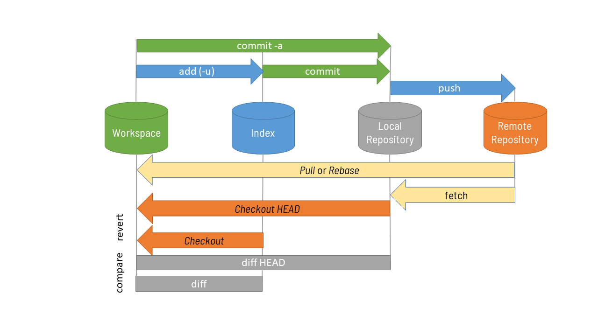
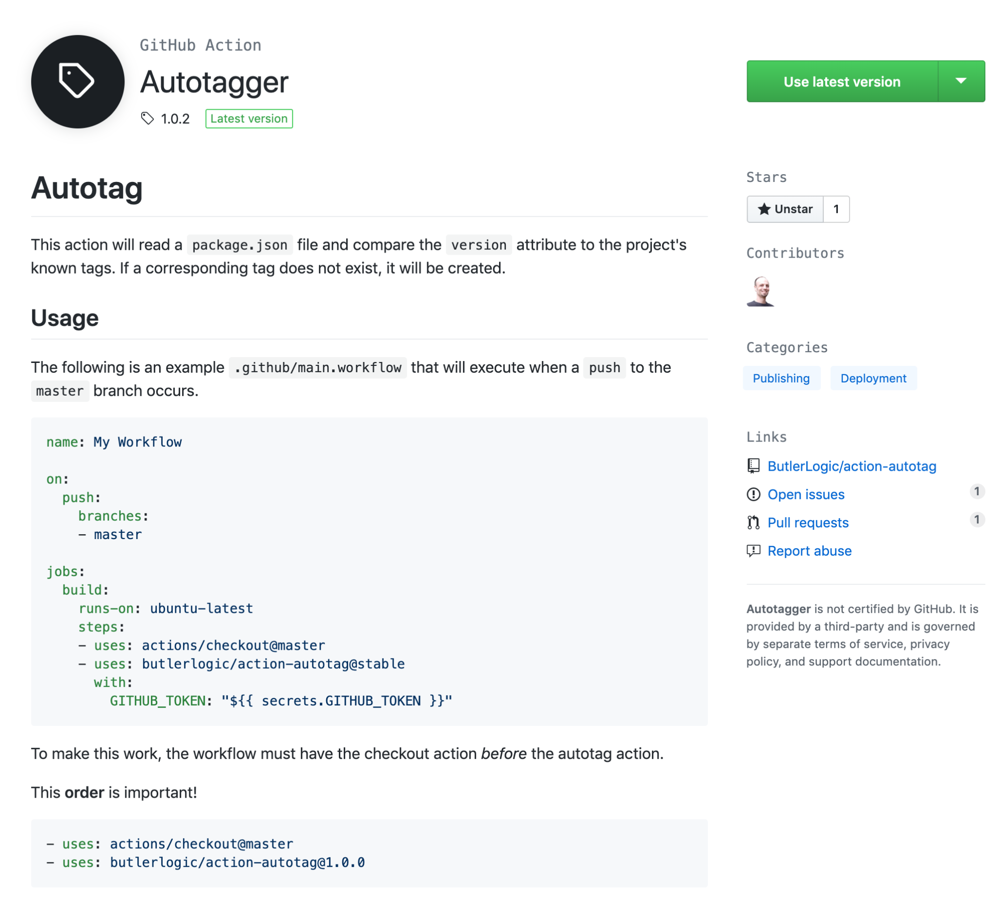
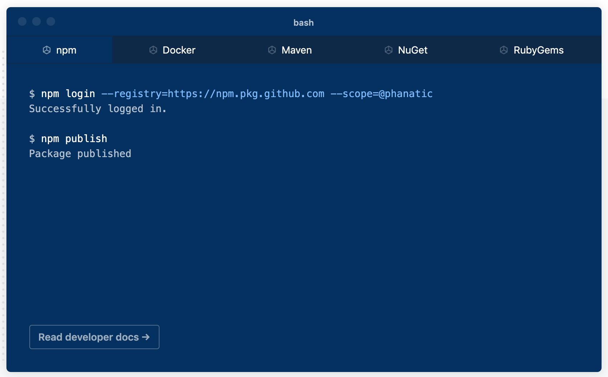
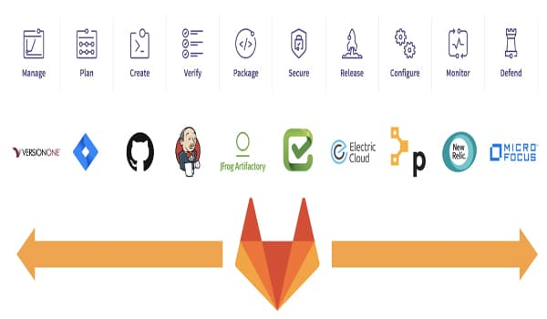
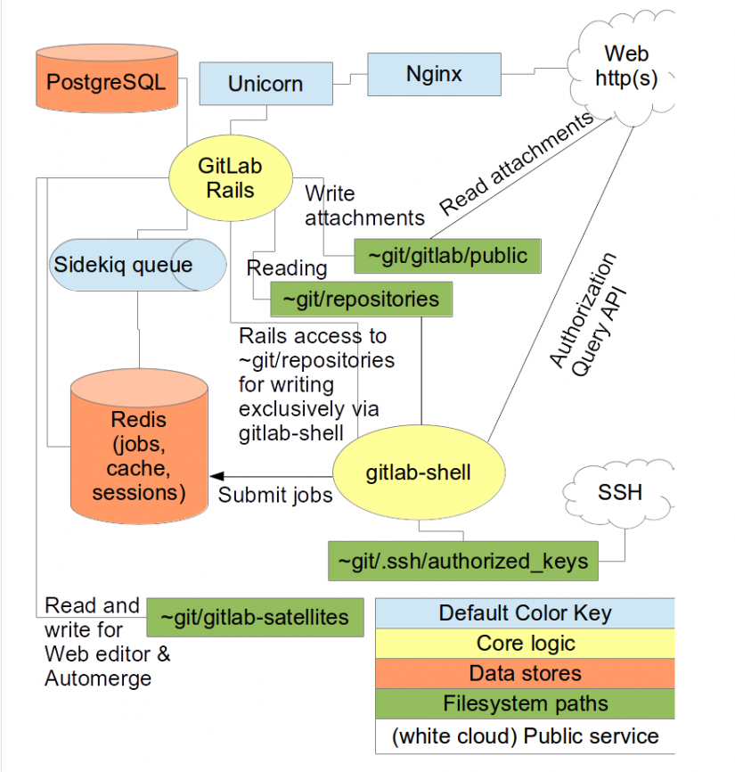

<p align="center">
	
</p>

# Mục lục

- [Mục lục](#mục-lục)
- [VCS và Git](#vcs-và-git)
	- [VCS là gì?](#vcs-là-gì)
	- [Tại sao lại cần nó?](#tại-sao-lại-cần-nó)
	- [Phân loại VCS](#phân-loại-vcs)
	- [Git là gì?](#git-là-gì)
	- [Cơ chế hoạt động?](#cơ-chế-hoạt-động)
	- [Dữ liệu lưu trữ trong Git đảm bảo tính toàn vẹn](#dữ-liệu-lưu-trữ-trong-git-đảm-bảo-tính-toàn-vẹn)
	- [Git có lợi ích gì?](#git-có-lợi-ích-gì)
	- [Thuật ngữ cơ bản về Git](#thuật-ngữ-cơ-bản-về-git)
- [Cài đặt và cấu hình Git](#cài-đặt-và-cấu-hình-git)
	- [Tải Git](#tải-git)
	- [Cài đặt Git](#cài-đặt-git)
	- [Cài đặt Git trên MacOS và Ubuntu](#cài-đặt-git-trên-macos-và-ubuntu)
	- [Cấu hình Git lần đầu](#cấu-hình-git-lần-đầu)
- [Trạng thái của Git](#trạng-thái-của-git)
- [Những câu lệnh Git cơ bản](#những-câu-lệnh-git-cơ-bản)
	- [Lệnh git init](#lệnh-git-init)
	- [Lệnh git init --bare](#lệnh-git-init---bare)
	- [Lệnh git add](#lệnh-git-add)
	- [Lệnh git status](#lệnh-git-status)
	- [Lệnh git commit](#lệnh-git-commit)
	- [Lệnh git reset](#lệnh-git-reset)
	- [Lệnh git log](#lệnh-git-log)
	- [Lệnh git diff](#lệnh-git-diff)
	- [Lệnh git clone](#lệnh-git-clone)
	- [Lệnh git checkout](#lệnh-git-checkout)
	- [Lệnh git switch](#lệnh-git-switch)
	- [Lệnh git restore](#lệnh-git-restore)
- [Gitignore](#gitignore)
	- [Gitignore là gì?](#gitignore-là-gì)
	- [Cách thức hoạt động của Gitignore là gì?](#cách-thức-hoạt-động-của-gitignore-là-gì)
	- [Các pattern format hay dùng](#các-pattern-format-hay-dùng)
	- [Tools](#tools)
	- [Phạm vi phủ sóng](#phạm-vi-phủ-sóng)
	- [Khi nào lên dùng Gitignore?](#khi-nào-lên-dùng-gitignore)
	- [Chú ý – Git cache](#chú-ý--git-cache)
- [Lý thuyết về Nhánh trong Git](#lý-thuyết-về-nhánh-trong-git)
	- [Branch là gì?](#branch-là-gì)
	- [Branch tích hợp (Integration branch)](#branch-tích-hợp-integration-branch)
	- [Branch chủ đề (Topic branch)](#branch-chủ-đề-topic-branch)
	- [Chuyển đổi branches](#chuyển-đổi-branches)
	- [HEAD](#head)
	- [Stash](#stash)
	- [Merge](#merge)
	- [Rebase](#rebase)
	- [Lệnh làm việc với nhánh](#lệnh-làm-việc-với-nhánh)
- [Làm việc với Remote Respository](#làm-việc-với-remote-respository)
	- [Remote Repository là gì?](#remote-repository-là-gì)
	- [Remote repository và local repository](#remote-repository-và-local-repository)
	- [Cài đặt để có Git Server](#cài-đặt-để-có-git-server)
	- [Cài đặt OpenSSH trên Server](#cài-đặt-openssh-trên-server)
	- [Tạo Remote Repository](#tạo-remote-repository)
	- [Thiết lập để làm việc với Remote Repository](#thiết-lập-để-làm-việc-với-remote-repository)
- [Lệnh cơ bản làm việc với Remote Repository](#lệnh-cơ-bản-làm-việc-với-remote-repository)
	- [Lệnh git fetch](#lệnh-git-fetch)
	- [Lệnh git pull](#lệnh-git-pull)
	- [Lệnh git push](#lệnh-git-push)
	- [Lệnh Git remote](#lệnh-git-remote)
	- [Sự khác nhau của git fetch và git pull](#sự-khác-nhau-của-git-fetch-và-git-pull)
- [GitHub](#github)
	- [Github là gì?](#github-là-gì)
	- [Cách làm việc trên GitHub](#cách-làm-việc-trên-github)
	- [Thuật ngữ cơ bản về GitHub](#thuật-ngữ-cơ-bản-về-github)
	- [Lịch sử của GitHub](#lịch-sử-của-github)
	- [Lợi ích của Github đối với lập trình viên](#lợi-ích-của-github-đối-với-lập-trình-viên)
	- [Github là một kho tài nguyên tuyệt vời](#github-là-một-kho-tài-nguyên-tuyệt-vời)
	- [Github Action](#github-action)
	- [Github Package Registry](#github-package-registry)
- [GitLab và Kiến trúc Gitlab](#gitlab-và-kiến-trúc-gitlab)
	- [GitLab là gì?](#gitlab-là-gì)
	- [Phiên bản Gitlab](#phiên-bản-gitlab)
	- [Tại sao nên dùng GitLab?](#tại-sao-nên-dùng-gitlab)
	- [Protected branches:](#protected-branches)
	- [Tầng vật lý của GitLab](#tầng-vật-lý-của-gitlab)
	- [System layout](#system-layout)
	- [Components](#components)
	- [Cách cài đặt GitLab trên Windows](#cách-cài-đặt-gitlab-trên-windows)
	- [Cách cài đặt GitLab trên Linux](#cách-cài-đặt-gitlab-trên-linux)
	- [Lưu ý khi sử dụng GitLab](#lưu-ý-khi-sử-dụng-gitlab)
	- [Thêm người dùng](#thêm-người-dùng)
	- [Tạo nhóm](#tạo-nhóm)
	- [User Permissions](#user-permissions)
	- [Bảo vệ Branches](#bảo-vệ-branches)
	- [Khả năng hiển thị Project](#khả-năng-hiển-thị-project)
- [Tag trong Git](#tag-trong-git)
	- [Tag trong Git](#tag-trong-git-1)
	- [Một số lệnh thông dụng với tag trong Git.](#một-số-lệnh-thông-dụng-với-tag-trong-git)
	- [Tạo release (phiên bản phát hành) trên GitHub](#tạo-release-phiên-bản-phát-hành-trên-github)
- [Credit](#credit)

# VCS và Git

## VCS là gì?

**Hệ thống quản lý phiên bản - Version Control System (VCS)** là một hệ thống ghi nhận và lưu lại sự thay đổi của các file theo thời gian, từ hệ thống đó một file có thể phục hồi quay về trạng thái (phiên bản) ở một thời điểm trước đó. Ngoài ra bạn có thể theo dõi sự thay đổi của một file theo thời gian, ai đã thay đổi, thay đổi vào lúc nào,... Đồng thời, nó cũng giúp cho ta dễ dàng hợp tác làm việc với nhiều người khác trong cùng một dự án.

<p align ="center">
	
</p>

Có nhiều hệ thống VCS mà bạn có thể chọn sử dụng như: Concurrent Versions System, Subversion, Git, Mercurial,...Nổi bật trong đó là **Git**

## Tại sao lại cần nó?

Giả sử trường hợp bạn cần làm dự án theo team 3, 4 thành viên. Như vậy mỗi thành viên sẽ code một số module nhỏ, cuối cùng sẽ phải đến ngày gộp code. Có 2 trường hợp xảy ra, hoặc là team bạn phải ra quán coffee gộp code (như mình từng làm khi mới học code) hoặc team bạn sử dụng version control. Với công cụ này, mỗi thành viên team bạn có thể tạo ra 1 phiên bản riêng cho mình (branch) và làm việc độc lập trên đó, khi cần gộp code, bạn chỉ việc gộp 2 branch lại với nhau, mọi thứ đều được version control đánh dấu thời gian rõ ràng, công việc sẽ trở nên dễ dàng hơn rất nhiều.

## Phân loại VCS

**VCS Cục Bộ**

Khi bạn chưa biết đến VCS thì chắc là bạn đã từng làm việc sau: _Giả sử bạn có một thư mục chứa một số file (code, media ...), trước khi bạn sửa đổi các file đó có thể bạn sẽ copy lại thư mục và lưu lại với một cái tên đánh dấu để nhỡ cần phục hồi lại các file gốc thì có thể copy trở lại. Việc làm của bạn chính là bạn vừa vận hành một hệ thống quản lý phiên bản_. Cách làm này đơn giản tuy nhiên gây ra nhiều lỗi như bạn có thể quyên mất thư mục ban đầu lưu trữ nhất là khó mà nhớ thời điểm lưu lại khi copy nhiều lần thư mục.

Chỉ cần từ 10 thư mục trở lên thôi là bảo đảm công việc sẽ bắt đầu có sự nhầm lẫn.

Để giải quyết vấn đề này, các lập trình viên từ lâu đã phát triển nên một VCS cục bộ với một cơ sở dữ liệu đơn giản chỉ nhằm mục đích duy nhất: Lưu giữ tất cả từng phiên bản và ghi nhận các thay đổi của từng phiên bản sau đó. Hệ thống đó bạn có thể gọi là VCS cục bộ, mô hình hóa hoạt động như hình.

<p align="center">
	
</p>

Công cụ nổi tiếng có thể kể đến là **RCS** (Revision Control System), vẫn còn được sử dụng ở nhiều hiện nay. Thậm chí trong các máy tính MAC OS X nó vẫn tích hợp vào các công cụ lập trình (IDE) lệnh rcs để người dùng có thể tự quản lý các phiên bản khác nhau của dự án tại từng thời điểm.

**VCS Trung Tâm**

Nhưng nếu áp dụng như cách trên vừa nói, chuyện lại nảy sinh tiếp theo là: Mình muốn chia sẻ các phiên bản dự án của mình với các đồng nghiệp khác trong cùng hệ thống (trong một công ty) thì làm thế nào? Vẫn phải tìm và copy rồi gửi cho đồng nghiệp? Việc tự quản lý các phiên bản để tránh nhầm lẫn đã giải quyết xong rồi, còn chia sẻ thế nào cho nhanh chóng lại nảy sinh.

Giải pháp VCS tập trung ra đời.

Các hệ thống này – có thể kể tên như CVS, Subversion, Perforce – đều triển khai một máy chủ chứa toàn bộ các tập tin phiên bản khác nhau của tất cả các dự án của từng người trong nội bộ công ty đang làm việc. Các đồng nghiệp này có thể truy xuất lên đây và xem của nhau đều được.

<p align="center">
	
</p>

Cách này tỏ ra hiệu quả trong thời gian dài, khi mà nó giải quyết được cả 2 vấn đề là tổ chức, lưu trữ các phiên bản hiệu quả; chia sẻ và truy xuất các phiên bản của từng cá nhân khác nhau dễ dàng hơn.

Tuy nhiên CVCS vẫn có nhược điểm khi Sever bị dừng thì không thể kết nối các thành viên làm việc, hoặc mất dữ liệu (do ở đĩa hư hỏng) khì rất khó khôi phục lại file.

**VCS Phân Tán**

VCS phân tán sẽ giải quyết câu chuyện đau đầu trên. Có thể kể những cái tên tiêu biểu như Git, Mercurial, Bazaar hay Darcs. Ở giải pháp này, các máy truy cập tới không đơn giản chỉ tải về phiên bản mới nhất của dữ liệu, mà nó sẽ tải về toàn bộ kho chứa (Repository). Do đó, nếu có một máy chủ nào ngưng hoạt động đi nữa, thì cũng có thể truy xuất được dữ liệu dễ dàng từ một máy khác để khôi phục lại những gì đã mất.

<p align="center">
	
</p>

Điểm nổi trội khác nữa có thể kể đến, đó là các hệ thống kiểu này xử lý rất hiệu quả trong việc quản lý các Repository từ xa, nhằm giúp cho một người có thể cộng tác và làm việc với nhiều người khác nhau ở bất kỳ đâu.

**Git** chính là hệ thống quản lý phiên bản phân tán (DVCS), với các ưu điểm: tốc độ, đơn giản, phân tán, phù hợp với dự án lớn nhỏ.

## Git là gì?

**Git** là một hệ thống quản lý phiên bản phân tán (Distributed Version Control System – DVCS), nó là một trong những hệ thống quản lý phiên bản phân tán phổ biến nhất hiện nay. Git cung cấp cho mỗi lập trình viên kho lưu trữ (repository) riêng chứa toàn bộ lịch sử thay đổi.

## Cơ chế hoạt động?

Sự khác biệt chính giữa Git và bất kỳ VCS nào khác (bao gồm Subversion…) là cách Git nghĩ về dữ liệu của nó.

Về mặt khái niệm, hầu hết các hệ thống khác đều lưu trữ thông tin dưới dạng danh sách các thay đổi dựa trên file. Các hệ thống này (CVS, Subversion, Perforce, Bazaar, v.v.) coi thông tin chúng lưu giữ dưới dạng một tập hợp các file và những thay đổi được thực hiện đối với mỗi file theo thời gian.

<p align="center">
	
</p>

Git không nghĩ đến hoặc lưu trữ dữ liệu của mình theo cách này. Thay vào đó, Git coi thông tin được lưu trữ là một tập hợp các snapshot – ảnh chụp toàn bộ nội dung tất cả các file tại thời điểm.

Mỗi khi bạn “commit”, Git sẽ “chụp” và tạo ra một snapshot cùng một tham chiếu tới snapshot đó. Để hiệu quả, nếu các tệp không thay đổi, Git sẽ không lưu trữ lại file — chỉ là một liên kết đến tệp giống file trước đó mà nó đã lưu trữ. Git nghĩ về dữ liệu của nó giống như dưới đây:

<p align="center">
	
</p>

Đây là điểm khác biệt quan trọng giữa Git và gần như tất cả các VCS khác. Nó khiến Git phải xem xét lại hầu hết mọi khía cạnh của kiểm soát phiên bản mà hầu hết các hệ thống khác đã sao chép từ thế hệ trước. Điều này làm cho Git giống như một hệ thống tệp nhỏ với một số công cụ cực kỳ mạnh mẽ được xây dựng trên nó, thay vì chỉ đơn giản là một VCS.

## Dữ liệu lưu trữ trong Git đảm bảo tính toàn vẹn

Mọi thứ trước khi được lưu trữ vào Git đều đước kiểm tra bởi mã băm (hash, checksum), có nghĩa là không thể thay đổi nội dung của file mà Git không biết về sự thay đổi đó. Chức năng này giúp cho bạn không thể mất thông tin khi trao đổi dữ liệu hay file lỗi mà không thể nhận ra được. Git sử dũng mã hash SHA-1, mỗi chuỗi hash SHA-1 sinh ra căn cứ theo nội dung của file dài 40 ký tự (tạo ra từ các ký tự trong khoảng thập lục phân : 0-9, a-f) có dạng:

```hash
62FC2DBFB0CB299DD8548286FE1BB1D2B2041379
```

Mã hash kiểu này bạn sẽ gặp thường xuyên khi làm việc với Git vì mọi thứ lưu trong dữ liệu đều căn cứ theo mã hash này.

## Git có lợi ích gì?

Các dự án thực tế thường có nhiều lập trình viên làm việc song song. Vì vậy, một hệ thống kiểm soát phiên bản như Git là cần thiết để đảm bảo không có xung đột code giữa các lập trình viên.

Ngoài ra, các yêu cầu trong các dự án như vậy thay đổi thường xuyên. Vì vậy, một hệ thống kiểm soát phiên bản cho phép các nhà phát triển revert và quay lại phiên bản cũ hơn của code.

Cuối cùng, đôi khi một số dự án đang được chạy song song liên quan đến cùng một cơ sở code. Trong trường hợp như vậy, khái niệm phân nhánh trong Git là rất quan trọng.

- Dễ sử dụng, thao tác nhanh, gọn, lẹ và rất an toàn.
- Sễ dàng kết hợp các phân nhánh (branch), có thể giúp quy trình làm việc code theo nhóm đơn giản hơn rất nhiều.
- Chỉ cần clone mã nguồn từ kho chứa hoặc clone một phiên bản thay đổi nào đó từ kho chứa, hoặc một nhánh nào đó từ kho chứa là bạn có thể làm việc ở mọi lúc mọi nơi.
- Deployment sản phẩm của bạn một cách không thể nào dễ dàng hơn.

## Thuật ngữ cơ bản về Git

Dưới đây là thuật ngữ cơ bản của **Git**:

- **repository**: Nơi lưu trữ dữ liệu. **Git** quản lý dữ liệu trong đơn vị lưu trữ này. Lịch sử sửa đổi cũng được lưu lại.
- **remote repository**: Một kho lưu trữ trên máy chủ. Lưu trên máy chủ và dùng để chia sẻ.
- **local repository**: Một kho lưu trữ local.
- **clone**: Để nhân đôi một kho lưu trữ từ xa. Lịch sử sửa đổi cũng được nhân đôi.
- **branch**: Quản lý một loạt các sửa đổi bằng cách phân nhánh từ dòng chính thành một nhánh riêng. Sửa đổi trên một nhánh này sẽ không bị ảnh hưởng bởi các nhánh khác, vì vậy bạn có thể cùng một lúc phát triển nhiều cái trong cùng một kho lưu trữ.
- **checkout**: Di chuyển đến một nhánh khác và đặt thư mục làm việc của bạn ở bất kỳ trạng thái `commit` nào.
- **commit**: Để phản ánh các nội dung sửa đổi trong kho lưu trữ local.
- **push**: Để phản ánh nội dung sửa đổi của **kho lưu trữ local** sang kho **lưu trữ từ xa**.
- **pull**: Để phản ánh nội dung sửa đổi của **kho lưu trữ từ xa** đến **kho lưu trữ local**.
- **merge**: Kết hợp sửa đổi từ các nhánh khác nhau. Lịch sử thay đổi vẫn còn lưu ở tất cả các nơi.
- **conflict**: Tại thời điểm merge, cùng 1 nội dung của cùng một file đã bị sửa đổi ở cả từ xa và local, do đó không thể merge tự động. Bạn sẽ cần phải chỉnh sửa thủ công ở cả hai nơi cùng nhau.

# Cài đặt và cấu hình Git

## Tải Git

Có nhiều cách để đến với trang chủ của **Git**, bạn có thể tìm kiếm trên Google và lựa chọn trong kết quả tìm kiếm hoặc đến trực tiếp trang chủ bằng cách gõ vào thanh điều hướng trình duyệt đường dẫn

> https://git-scm.com/

Bấm vào nút `Download 2.32.0 for Windows` để tải tập tin cài đặt về.

_Lưu ý rằng con số **2.32.0** là phiên bản **Git** hiện tại được phát hành, nó có thể bị thay đổi bởi các phiên bản mới hơn. Xem thêm ảnh minh họa bên dưới_

<p align="center">
	
</P>

Hệ thống trang tải của Git sẽ tự động gửi tập tin cài đặt phù hợp với hệ điều hành Windows hiện tại của bạn. _Ngoài ra, bạn còn có thể tải thêm các phiên bản khác tùy ý._

<p align="center">
	
</P>

## Cài đặt Git

Sau quá trình chờ tải về, bạn sẽ có được một tệp thực thi trên máy có tên dạng `Git-2.32.02-64-bit.exe`, trong đó:

- **2.32.0** đã nói ở trên bước 1 rồi, là phiên bản của Git lúc đó.
- **64-bit** là kiến trúc mà hệ điều hành Windows của máy đang dùng để cài Git. _Xem thêm ảnh minh họa bên dưới:_

<p align="center">
	
</P>

Thực thi tập tin đó bằng cách `Bấm đôi chuột` hoặc `Bấm chuột phải` lên tệp đó rồi chọn `Open`.

Tiếp tục, chúng ta sẽ gặp `Điều khoản (Giấy phép)`, nếu đọc tốt tiếng Anh thì bạn có thể dành thời gian để đọc cho rõ. Bình thường, chúng ta hay `Đồng ý` mà không đọc gì tất.

Đọc xong rồi thì nhấn nút `Next `. _Xem thêm ảnh minh họa bên dưới:_

<p align="center">
	
</P>

Chương trình cài đặt sẽ cho chúng ta lựa chọn **vị trí lưu trữ để cài đặt chương trình Git**. Bạn có thể nhấn nút `Browse`... để chọn lại hoặc gõ đường dẫn vào ô. Đồng thời, chương trình cài đặt cũng sẽ cho bạn biết mức độ chiếm dụng của dữ liệu sẽ cài lên máy được yêu cầu để chứa là bao nhiêu (kích cỡ MB tối thiểu). Chọn xong đường dẫn rồi thì nhấn `Next`.

Trình cài đặt lại cho bạn một danh sách các lựa chọn:

**Các lựa chọn đã được chọn sẵn (tick)**: Bao gồm các trình cơ bản của Git là dòng lệnh, giao diện đồ họa, các gói hỗ trợ, khai báo loại tập tin,... Chúng ta nên để cho nó chọn đi.

Nói thêm về các dòng chưa chọn:

- **Additional icon, bao gồm On the Desktop**: là cài biểu tượng lên màn hình làm việc để bạn mở giao diện đồ họa và cửa sổ dòng lệnh của Git nhanh hơn. Cũng nên chọn chứ! Nếu bạn lười vào Start menu.
- **Use a TrueType font in all console windows**: là dùng Phông chữ kiểu TrueType cho tất cả các cửa sổ dòng lệnh. Nếu chọn dòng này, Git có thể hỗ trợ tốt hơn tiếng Việt trên các cửa sổ lệnh, bạn dùng giao diện đồ họa thì không cần chọn cũng được.
- **Check daily for Git for Windows updates**: là kiểm tra phiên bản hằng ngày xem có Git mới không để cập nhật luôn. Nếu bạn là người thích sự ổn định, ít thay đổi thì có thể bỏ qua lựa chọn này, còn nếu bạn là người thích theo đuổi những điều mới mẽ thì chọn để xem các tính năng của Git mới sau này là gì nhé! Ngoài ra, cập nhật thường xuyên cũng là một trong những việc tăng cường bảo mật, khắc phục các lỗi của bản cũ.
  Chọn xong sau đó nhấn `Next`
- **Add a git Bash profile to Windows Terminal**: Thêm shell git Bash vào Windows Terminal. Đây là tính năng khá mới và thích hợp cho Windows 11.

_Xem thêm ảnh minh họa bên dưới:_

<p align="center">
	
</P>

Quá trời nhiều lựa chọn, và tiếp theo là lựa chọn xem nên đạt Git vào Start menu như thế nào. Có thể chọn `Don't create a Start Menu folder` để không tạo ra cái thư mục Git trên Start Menu, nếu bạn không cần dùng tới. Bình thường, cứ không chọn, để nguyên như vậy rồi bấm `Next` thôi.

Sau khi lựa chọn Start Menu, trình cài đặt yêu cầu lựa chọn một chương trình soạn thảo để chúng ta có thể biên tập lệnh cho Git bash. Mặc đinh là dùng Vim. Xem hình ảnh minh họa bên dưới. Tuy nhiên tôi sẽ sử dụng Visual Studio Code vì máy tính Windows của mình đã có cài sẵn rồi.

<p align="center">
	
</P>

Tiếp đên, trình cài đặt sẽ hỏi chúng ta lựa chọn tên nhanh sau khi gõ lệnh `git init`, Ở phần này mình sẽ để mặc định là sau khi gõ lệnh `git init` sẽ tạo nhánh có tên là `master`

<p align="center">
	
</P>

Tiếp theo, trình cài đặt Git yêu cầu chúng ta lựa chọn cài đặt về biến môi trường, nếu không cần dùng biến `PATH` để là môi trường mặc định cho Git thì bạn có thể lựa chọn `Use Git from Git Bash only`.

Mình cài Git trên Windows, cũng nên tạo một môi trường cho Git để thuận tiện hơn. Vì thế mình vẫn để nguyên lựa chọn là `Git from the command line and also from 3rd-party software`. Rồi còn chờ gì nữa mà không nhấn `Next`. Xem hình ảnh minh họa bên dưới.

<p align="center">
	
</P>

Bên dưới, là hình ảnh trình cài đặt Git yêu cầu bạn lựa chọn sử dụng phương thức bảo mật nào cho các kết nối giao thức HTTPS (giap thức web tăng cường bảo mật). Bạn có thể chọn dùng theo loại chứng chỉ nào mà bạn thích. Ở đây, tôi vẫn sẽ để mặc định là `Use the OpenSSL library` để sử dụng thư viện chứng chỉ bảo mật này (thư viện mở).

Nhấn tiếp nút `Next`.

<p align="center">
	
</P>

Tiếp theo, lựa chọn chế độ dấu kết thúc dòng (xuống dòng). Sở dĩ có lựa chọn này là do dấu xuống dòng trong hệ điều hành Linux, Unix, MacOS và Windows là khác nhau.

Chúng ta cứ để mặc định là `Checkout Windows-style, commit Unix-style line endings` để Git tự chuyển qua lại giữa các loại này khi tải mã nguồn lên xuống giữa máy Windows của mình và máy chủ lưu trữ Repository. Xem hình ảnh minh họa bên dưới

Rồi, bấm tiếp nút `Next`.

<p align="center">
	
</P>

Tiếp theo trình cài đặt Git yêu cầu chúng ta lựa chọn chương trình hiển thị cửa sổ dòng lệnh để tương tác với chúng ta về sau.

Bạn nào là Fan ruột thật sự ruột của Windows thì chọn `Use Windows' default console window` để chọn cái màn hình đen chữ trắng mặc định của Windows (mách nhỏ là nó có thể đổi màu).

Tuy nhiên, để cho thuận tiện hiển thị tiếng Việt và đẹp mắt, chúng ta nên chọn như mặc định là Use `MinTTY (the default terminal of MSYS2)` để Git cài một trình giả lập cửa sổ dòng lệnh tên là `MinTTY` của `MSYS2`. Bấm nút `Next` tiếp thôi nào!

<p align="center">
	
</P>

Tiếp theo, trình cài đặt Git sẽ hỏi thiết lập `git pull`, ở mình sẽ để `Default` và ấn `Next`.

<p align="center">
	
</P>

Tiếp theo git sẽ hỏi chọn khả năng trợ giúp khi sử dụng Git, nếu như bạn không muốn trợ giúp thì hãy ấn `None`. Rồi ân `Next`

<p align="center">
	
</P>

Tiếp theo là một số cài đặt về lưu trữ (cài đặt mở rộng). Cứ mặc định mà bấm `Next` thôi bạn ơi! Xem hình ảnh minh họa bên dưới.

<p align="center">
	
</P>

Tiếp theo là một số cài đặt về thử ngiệm. Sau đó ấn `Install` để cài đặt. Xem hình ảnh minh họa bên dưới.

<p align="center">
	
</P>

Sau khi cài đặt xong mở PowerShell hoặc Command Prompt lên gõ lệnh:

```powershell
git --version
```

Nếu kết quả trả về như hình bên dưới là bạn đã cài đặt Git thành công.

<p align="center">
	
</P>

Vậy là chúng ta đã cài đặt xong Git!!

## Cài đặt Git trên MacOS và Ubuntu

**MacOS**

**Bước 1:** cài đặt Git

Mở terminal và chạy lệnh dưới đây để cài đặt Git bằng Homebrew:

```bash
brew install git
```

Lệnh trên sẽ cài đặt Git trên máy của chúng ta. Bước tiếp theo là xác minh cài đặt.

**Bước 2:** Xác minh cài đặt

Điều cần thiết là phải đảm bảo rằng quá trình cài đặt có thành công hay không.

Để xác minh xem cài đặt đã thành công hay chưa, hãy chạy lệnh dưới đây:

```bash
git --version
```

Lệnh trên sẽ hiển thị phiên bản đã được cài đặt trên hệ thống của bạn. Hãy xem xét đầu ra dưới đây:

```bash
git version 2.32.0
```

**Ubuntu**

**Bước 1:** cài đặt Git

Mở terminal và chạy lệnh dưới đây để cài đặt Git:

```bash
sudo apt install git all
```

Lệnh trên sẽ cài đặt Git trên máy của chúng ta. Bước tiếp theo là xác minh cài đặt.

**Bước 2:** Xác minh cài đặt

Điều cần thiết là phải đảm bảo rằng quá trình cài đặt có thành công hay không.

Để xác minh xem cài đặt đã thành công hay chưa, hãy chạy lệnh dưới đây:

```bash
git --version
```

Lệnh trên sẽ hiển thị phiên bản đã được cài đặt trên hệ thống của bạn. Hãy xem xét đầu ra dưới đây:

```bash
git version 2.32.0
```

## Cấu hình Git lần đầu

Bây giờ Git đã có trên hệ thống, bạn muốn tuỳ biến một số lựa chọn cho môi trường Git của bạn. Bạn chỉ phải thực hiện các bước này một lần duy nhất; chúng sẽ được ghi nhớ qua các lần cập nhật. Bạn cũng có thể thay đổi chúng bất kỳ lúc nào bằng cách chạy lại các lệnh.

Git cung cấp sẵn git config cho phép bạn xem hoặc chỉnh sửa các biến cấu hình để quản lý toàn bộ các khía cạnh của Git như giao diện hay hoạt động. Các biến này có thể được lưu ở ba vị trí khác nhau:

- `/etc/gitconfig` : Chứa giá trị cho tất cả người dùng và kho chứa trên hệ thống. Nếu bạn sử dụng `--system` khi chạy `git config`, thao tác đọc và ghi sẽ được thực hiện trên tập tin này.
- `~/.gitconfig` : Riêng biệt cho tài khoản của bạn. Bạn có thể chỉ định Git đọc và ghi trên tập tin này bằng cách sử dụng `--global`.
- Tập tin config trong thư mục git `(.git/config)` của bất kỳ kho chứa nào mà bạn đang sử dụng: Chỉ áp dụng riêng cho một kho chứa. Mỗi cấp sẽ ghi đè các giá trị của cấp trước nó, vì thế các giá trị trong `.git/config` sẽ "ghi đè" các giá trị trong `/etc/gitconfig`.
- Trên Windows, Git sử dụng tập tin `.gitconfig` trong thư mục `$HOME` (`%USERPROFILE% trên môi trường Windows`), cụ thể hơn đó là `C:\Documents` and `Settings\$USER` hoặc `C:\Users\$USER`, tuỳ thuộc vào phiên bản Windows đang sử dụng (`$USER là %USERNAME%` trên môi trường Windows). Nó cũng tìm kiếm tập tin `/etc/gitconfig`, mặc dù nó đã được cấu hình sẵn chỉ đến thư mục gốc của MSys, có thể là một thư mục bất kỳ, nơi bạn chọn khi cài đặt.

**Thiết lập danh Tính Của Bạn**

Việc đầu tiên bạn nên làm khi cấu hình Git là chỉ định tên tài khoản và địa chỉ e-mail. Điều này rất quan trọng vì mỗi Git sẽ sử dụng chúng cho mỗi lần commit, những thông tin này được gắn bất di bất dịch vào các commit:

```bash
$ git config --global user.name "FoxMinChan"
$ git config --global user.email nguyenxuannhan407@gmail.com
```

Vì chỉ phải làm việc này một lần duy nhất nên như sử dụng `--global`, vì Git sẽ sử dụng các thông tin đó cho tất cả những gì bạn làm trên hệ thống. Nếu bạn muốn sử dụng tên và địa chỉ e-mail khác cho một dự án riêng biệt nào đó, bạn có thể chạy lại lệnh trên không sử dụng `--global `trên dự án đó.

**Trình Soạn Thảo**

Bây giờ danh tính của bạn đã được cấu hình xong, bạn có thể lựa chọn trình soạn thảo mặc định sử dụng để soạn thảo các dòng lệnh. Mặc định, Git sử dụng trình soạn thảo mặc địch của hệ điều hành, thường là Vi hoặc Vim. Nếu bạn muốn sử dụng một trình soạn thảo khác, như Emacs, bạn có thể sửa như sau:

```bash
$ git config --global core.editor emacs
```

Ở phần cài đặt Git, mình đã set Visual Studio Code làm trình soạn thảo mặc định cho nên trình soạn thảo mặc đinh của mình là Visual Studio Code.

**Công Cụ So Sánh Thay Đổi**

Một lựa chọn hữu ích khác mà bạn có thể muốn thay đổi đó là chương trình so sánh sự thay đổi để giải quyết các trường hợp xung đột nội dung. Ví dụ bạn muốn sử dụng vimdiff:

```bash
$ git config --global merge.tool vimdiff
```

Git chấp nhận kdiff3, tkdiff, meld, xxdiff, emerge, vimdiff, gvimdiff, ecmerge, và opendiff là các công cụ trộn/sát nhập (merge) hợp lệ. Bạn cũng có thể sử dụng một công cụ yêu thích khác.

**Kiểm Tra Cấu Hình**

Nếu như bạn muốn kiểm tra các cấu hình cài đặt, bạn có thể sử dụng lệnh `git config --list` để liệt kê tất cả các cài đặt của Git:

```powershell
diff.astextplain.
textconv=astextplain
filter.lfs.clean=git-lfs clean -- %f
filter.lfs.smudge=git-lfs smudge -- %f
filter.lfs.process=git-lfs filter-process
filter.lfs.required=true
http.sslbackend=openssl
http.sslcainfo=C:/Program Files/Git/mingw64/ssl/certs/ca-bundle.crt
core.autocrlf=true
core.fscache=true
core.symlinks=true
pull.rebase=false
credential.helper=manager-core
credential.https://dev.azure.com.usehttppath=true
init.defaultbranch=master
core.editor="C:\Users\Nhan Nguyen\AppData\Local\Programs\Microsoft VS Code\Code.exe" --wait
user.email=nguyenxuannhan407@gmail.com
user.name=FoxMinChan
```

Bạn cũng có thể kiểm tra giá trị của một từ khoá riêng biệt nào đó bằng cách sử dụng `git config {key}`:

```powershell
git config user.name
FoxMinChan
```

# Trạng thái của Git

Mỗi tập tin trong Git được quản lý dựa trên ba trạng thái đó là **committed**, **modified**, và **staged**. Trong đó:

- **Committed** có nghĩa là dữ liệu đã được lưu trữ một cách an toàn trong cơ sở dữ liệu, tức là những gì bạn đã commit thành công.
- **Staged** là bạn đã đánh dấu sẽ commit phiên bản hiện tại của một tập tin đã chỉnh sửa trong lần commit sắp tới. Trạng thái này xảy ra khi bạn sử dụng lệnh git add <file_name> nhưng chưa commit.
- **Modified** có nghĩa là bạn đã thay đổi tập tin nhưng chưa commit vào cơ sở dữ liệu, tức là bạn chưa sử dụng lênh git add và git commit.

Như vậy với 3 trạng thái này đã tạo ra ba phần riêng biệt của một dự án có sử dụng Git:

- **Khu vực Git (Git directory)**: Là thư mục lưu trữ siêu dữ liệu (metadata) và cơ sở dữ liệu của dự án, thư mục này sẽ bị ẩn bởi hệ điều hành Windows nên bạn phải bật chức năng hiển thị file ẩn thì mới thấy được. Khu vực này sẽ tiếp nhận và lưu trữ các commit từ stage area.
- **Khu vực làm việc (Working directory)**: Nếu bạn không sử dụng Remote repository thì đây là bản sao của dự án, còn không thì đây là thư muc chính của dự án và branch master chính là bản chính, còn các branch mới tạo là branch bản sao.
- **Khu vực tổ chức (staging area)**: đây là một tập tin đơn giản nằm trong thư mục git, nó sẽ chứa thông tin về trạng thái của một file trong dự án.

<p align="center">
	
</P>

Như vậy nếu bạn thay đổi một file nhưng chưa sử dụng lệnh git add và git commit thì file đó ở trạng thái Modified, còn nếu bạn đã sử dụng lệnh git add thì sẽ ở trạng thái staged, còn đã commit thì sẽ ở trạng thái Committed.

**Commited - sửa + add + commit**

```bash
$ git checkout task1
$ git add demo.txt
$ git commit -m "Sua file demo.txt"
```

**Staged - Sửa + add**

```bash
$ git checkout task1
$ git add demo.txt
```

**Modified - Sửa + ko làm gì**

```bash
$ git checkout task1
```

# Những câu lệnh Git cơ bản

## Lệnh git init

Lệnh git init được sử dưng để tạo, khởi tạo một kho chứa **Git** mới (Git Repo) ở local. Khi đang trong thư mục dự án chạy lệnh git init nó sẽ tạo ra một thư mục con (ẩn) tên .git, thư mục này chứa tất cả thông tin mô tả cho kho chứa dự án (Repo) mới - những thông tin này gọi là metadata gồm các thư mục như `objects`, `refs`, ... Có một file tên `HEAD` cũng được tạo ra - nó trỏ đến `commit` hiện tại.

Lệnh `git init` nhanh chóng tạo ra quản lý phiên bản của dự án dạng `none bare` mà bạn không cần có ngay một server để lưu Repo từ xa, không yêu cầu bạn phải nạp file dữ liệu nào. Tất cả phải làm là vào thư mục dự án cần khởi tạo và thi hành lệnh sau để khởi tạo:

```bash
git init
```

Sau lệnh này bạn có một Repo ở local và bắt đầu thực thi được các lệnh khác của Git.

## Lệnh git init --bare

Khi bạn cần tạo ra một Repo Git mà nó chỉ có chức năng lưu trữ - không có thư mục làm việc thì thực hiện lệnh:

```bash
git init --bare
```

Loại dự án Git này thì bạn có thể truy cập, lưu trữ, nhưng không soạn thảo, sửa file, thực hiện commit trực tiếp tại dự án. Thường tạo loại dự án này để lưu trữ như là Remote Repo (_Tạo Repo git trên Server_), từ đó lấy về Local (_lệnh git clone_), và để local đẩy dữ liệu Git lên

<p align="center">
	
</P>

## Lệnh git add

Lệnh `git add` sử dụng để **đánh chỉ mục (index)** các nội dung mới, mới cập nhật trong **thư mục làm việc**, nó chuẩn bị nội dung sắp xếp cho lần `commit` tiếp theo.

Khái niệm **đánh chỉ mục** ở trên có nghĩa là lưu lại **ảnh chụp** (snapshot) thông tin thay đổi của thư mục làm việc so với lần commit trước (hoặc so với snapshot chưa commit), snapshot lưu ở khu vực gọi là **staging** (sắp xếp, chuẩn bị)

Bạn có thể thực hiện lệnh `git add` nhiều lần để tạo tạo ra một snapshot cuối cùng trước khi thực hiện commit.

Hình ảnh sau cho biết những ảnh hưởng của lệnh `git add`:

<p align="center">
	
</P>

Lệnh git add có vài cách thực hiện với những tham số khác nhau:

**Đưa vào vùng staging file, thư mục cụ thể.**

Bạn thực hiện lệnh theo cú pháp:

```bash
$ git add file1 file2 dir1 dir2 ...
```

Ví dụ:

```bash
# Đưa vào staging file hutech.txt và file cntt.txt
git add hutech.txt cntt.txt

# Đưa thư mục tphcm (và file, thư mục con) vào staging
git add tphcm
```

Lệnh git add sẽ đưa file, thư mục vào staging - nếu file/thư mục chưa từng được giám sát bởi git nó sẽ bắt đầu giám sát và tạo snapshot là toàn bộ file/thư mục mới. Nếu đã từng giám sát - thì snapshot là nội dung thay đổi so với commit trước.

**Đưa vào vùng staging toàn bộ thư mục làm việc**

Trường hợp dùng phổ biến là đưa toàn bộ thư mục làm việc vào giám sát, và tạo snapshot trong vùng staging cho chúng thì dùng cú pháp lệnh:

```bash
git add --all
# Hoặc
git add -A
# Hoặc add [thư mục hiện tại]
git add .
```

**Lưu ý:** Lệnh trên có loại trừ (không đưa vào staging) những file, thư mục liệt kê ra trong một file `.gitignore`.

**Chú ý:** Sau khi đưa vào vùng staging, vùng này có snapshot thì bạn đã có thể sẵn sàng để thực hiện lệnh git commit để lưu sự thay đổi vào CSDL của Git

## Lệnh git status

Lệnh git status hiện thị thông tin khác nhau (do thêm mới, xóa đi, sửa đổi các file) giữa các file trong các trường hợp:

`1` Khác nhau giữa các file trong vùng staging (chỉ mục) và commit tại con trỏ HEAD (Thường HEAD ở vị trí commit cuối): `thông tin này bạn có thể thực hiện lệnh commit để lưu staging vào dữ liệu Git`

`2` Khác nhau giữa các file trong thư mục làm việc và trong staging: `bạn có thể chạy git add rồi commit`

`3` Khác nhau giữa thư mục làm việc và những file chưa được giám sát bởi Git: `bạn có thể chạy git add rồi commit`

Thông thường thì có thể thi hành ngay lệnh với cú pháp đơn giản sau để có thông tin trạng thái đầy đủ, chỉ tiết

```powershell
git status
```

<p align="center">
	
</P>

Nếu muốn hiện thị thông tin ngắn gọn hơn thì cho thêm tham số `-s`

```powershell
git status -s
```

Lúc này trước các file có sự thay đổi có thể có các ký tự tương ứng với các thông tin gồm:

- _' '_ = unmodified (không đổi)
- _M_ = modified (có sửa đổi)
- _A_ = added (file mới thêm)
- _D_ = deleted (file bị xóa)
- _R_ = renamed (đổi tên file)
- _C_ = copied (file copy từ file khác)
- _U_ = updated but unmerged (đã cập nhật, nhưng chưa merge)

<p align="center">
	
</P>

## Lệnh git commit

Lệnh `git commit` thực hiện lưu vào CSDL Git toàn bộ nội dung chứa trong `index` (vùng staging) và kèm theo nó là một đoạn text thông tin (log) mô tả sự thay đổi của của `commit` này so với `commit` trước. Sau khi `commit` con trỏ `HEAD` tự động dịch chuyển đến `commit` này (Trong nhánh hiện tại).

Khi thực hiện `commit` nếu bạn nhận ra ngay có sự nhầm lẫn nào đó bạn có thể khôi phục lại trạng thái cũ bằng lệnh `git reset` trình bày ở phần sau.

**Thực hiện commit đơn giản**

Lệnh commit cơ bản, đơn giản nhất là thực hiện với tham số -m để kèm dòng thông tin về commit

```bash
git commit -m "Ghi chú về commit"
```

Lệnh trên tạo ra một commit với nội dung lấy từ vùng staging, một điểm trong lịch sử commit được tạo ra với thông tin là dòng thông tin nhập vào, sau này bạn có thể xem lại lịch sử này bằng lệnh git log

**Thực hiện commit với tham số -a**

Khi cho tham số -a thì nó tương đương thực hiện lệnh git add để đưa các file đang được giám sát có sự thay đổi vào staging rồi tự động chạy git commit

```bash
git commit -a -m "Ghi chú về commit"
```

**Thay thế commit cuối bằng tham số --amend**

Nếu commit đã được tạo ra nhưng chưa thực hiện push lên remote (khi có làm việc với Remote Repo - nói ở các phần sau) thì bạn có thể tạo ra commit mới thay thế cho commit cuối cùng đó. Dùng trong trường hợp không muốn tạo ra nhiều commit trong lịch sử commit thì cho vào lệnh tham số --amend

```bash
git commit --amend -m "Thông tin về commit"
```

## Lệnh git reset

Khi đã thực hiện commit, commit đó chưa public (chưa đẩy lên Remote Repo bằng lệnh git push) thì bạn có thể hủy (undo) commit đó với hai trường hợp bằng lệnh `git reset` như sau:

**git reset với tham số --soft**

Trường hợp này sẽ hủy commit cuối, con trỏ HEAD sẽ chuyển về commit cha. Đồng thời những thay đổi của commit cuối được chuyển vào vùng staging nhằm để có cơ hội commit lại hoặc sửa đổi, cú pháp lệnh như sau:

```bash
git reset --soft HEAD~1
```

**git reset với tham số --hard**

Khi dùng tham số `--hard` thì kết quả giống với dùng tham số `--soft`, chỉ có một khác biết là nội dung thay đổi của commit cuối không đưa đưa vào staging mà bị hủy luôn. Trường hợp này dùng khi bạn quyết định hủy hoàn toàn commit cuối

```bash
git reset --hard HEAD~1
```

<p align="center">
	
</P>

**Một vài trường hợp dùng git reset khác**

**Hủy git add**

Nếu bạn đã dùng lệnh git add để cập nhật thay đổi vào vùng staging, bạn có thể hủy thao tác này bằng cách thực hiện lệnh:

```bash
git reset
```

**Hủy đưa một file vào staging**

Nếu muốn hủy một file nào đó trong vùng staging chứ không phải toàn bộ thì dùng lệnh

```bash
git reset -- filename
```

## Lệnh git log

Lệnh `git log` giúp bạn xem lại thông tin lịch sự commit, nhằm giám sát sự thay đổi của dự án. Lệnh `git log` có nhiều tham số để xuất ra, định dạng các thông tin hiện thị theo cách mong muốn. Bạn có thể định dạng cách các thông tin mỗi commit được in ra khi xem, cũng như có thể lọc thông tin nào đó.

Mặc đinh thi hành `git log` nó liệt kê các commit theo thứ tự từ mới nhất đến cũ nhất, mỗi commit có các thông tin gồm: mã hash của commit, dòng thông báo, người tạo commit và ngày tạo commit

```bash
git log
```

<p align="center">
	
</P>

Khi số lượng log nhiều, nó hiện thị trước một trang log, sau đó có dấu nhắc chờ lệnh để bạn điều hướng, tìm kiếm ... Để có trợ giúp về các lệnh này hãy nhấn h tại dấu nhắc lệnh

Một số phím chức năng bạn có thể nhập đề điều hướng và tìm kiếm trong log như:

- `return` - dòng tiếp theo
- `w` - trang tiếp
- `spacebar` - trang trước
- `q` - thoát
- `?pattern` - tìm kiếm, với pattern là mẫu tìm kiếm (keyword)
- `/pattern` - giống ?pattern
- `n` - đến vị trí tìm kiếm phía dưới
- `N` - đến kết quả tìm kiếm phía trước

**Một số thiết lập hay dùng với git log**

Nếu chỉ muốn hiện thị một số commit log, ví dụ hiện thị log của 2 commit cuối thì cho thêm `-2` vào lệnh

```bash
git log -2
```

Nếu muốn hiện thị chi tiết các thay đổi của từng commit thì thêm vào tham số `-p`

```bash
git log -p -2
```

Nếu hiện thị thống kế gọn hơn về sự thay đổi thì dùng tham số `--stat`, hoặc dạng ngắn gọn hơn là `--shortstat`

```bash
git log --stat -5
```

Định dạng thông tin chung về commit (mã hash, dòng thông tin) trên một dòng thì dùng tham số `--oneline`

```bash
git log --oneline
git log --stat -10 --oneline
```

**Lọc kết quả với git log**

Lọc theo ngày bạn có thể dùng tham số `--after="year-month-day"` hoặc `--before="year-month-day"` hoặc dùng cả hai để chỉ ra khoảng ngày. Ví dụ: hiện thị các log từ ngày 16/6/2019 đến ngày 18/6/2021

```bash
git log --after="2021-6-16" --before="2021-6-18"
```

Lọc theo người commit dùng tham số `--author="tác giả"`, có thể kết hợp nhiều người bằng ký hiệu `\|`

```bash
git log --oneline --author="FoxMinChan"
```

Lọc theo thông tin ghi chú về commit sử dụng thiết lập `--grep="keyword ..."`

```bash
git log --oneline --grep="init"
```

Lọc các commit liên quan đến file cụ thể, sử dụng thiết lập `--` rồi liệt kê các file

```bash
git log --oneline -- src/index.php
```

Lọc theo nội dung cập nhật sử dụng tham số `-S"nội dung tìm"`

```bash
git log --oneline --shortstat -S"sendmail"
```

**Lọc các commit bình thường** (tham số `--no-merges`) và các commit do gộp nhánh (tham số `--merges`)

```bassh
git log --merges
```

**Tự định dạng hiện thị**

Bạn có thể tùy chọn hiện thị dòng thông tin với tham số `--pretty="format"`, trong đó chuỗi format là định dạng thông tin sẽ hiện thị ra cho từng commit, một số dữ liệu theo định dạng đó là:

- `%H` mã hash đầy đủ của commit
- `%h` mã hash ngắn gọn (7 ký tự đầu của hash đầy đủ)
- `%an` tên người commit (định dạng theo `--date`, ví dụ `--date="shortdate"`)
- `%s` dòng thông tin commit

```bash
git log --pretty=format:"%h - %ad  %s" --date="short"
```

**Hiện thị log commit dạng đồ thị**

Bạn có thể xem lịch sự commit một cách trực quan của một nhánh, nhất là nhánh này trong lịch sử của nó có nhiều lần gộp nhánh

```bash
git log --graph --pretty="%h %ad %s" --date="short"
```

## Lệnh git diff

Lệnh `git diff` hiện thị thông tin thay đổi giữa thư mục làm việc và vùng index (staging) hoặc với commit cũ, thông tin thay đổi giữa index(staging) và commit, thông tin thay đổi giữa hai nhánh ...

Mặc định thi hành lệnh như sau:

```bash
git diff
```

Nó hiện thị thông tin tùy ngữ cảnh như sau:

- Thông tin khác nhau giữa thư mục làm việc và commit cuối khi mà vùng index (staging) không có dữ liệu gì
- Thông tin thay đổi giữa index và commit cuối nếu vùng index có dữ liệu

**Kiểm tra sự thay đổi thư mục làm việc**

Khi có sự thay đổi của thư mục làm việc mà chưa chỉ mục, thì có thể xem sự thay đổi của nó với commit cuối

```bash
git diff
```

**Kiểm tra sự thay đổi của index (staging) với commit cuối**

```bash
git diff --staged
```

**Kiểm tra thay đổi giữa hai commit**

```bash
git diff hash-commit1 hash-commit2
```

**Kiểm tra sự thay đổi của hai nhánh**

```bash
git diff branch1 branch2
```

## Lệnh git clone

Lệnh `git clone` để sao chep, copy một Git Repo (kho chứa dự án Git) về máy đang local. Một số trường hợp sử dụng git clone như:

- Copy một Repo từ máy Remote về Local
- Copy một Repo từ thư mục này sang một thư mục khác
- Copy một Repo từ một Url (https) ví dụ GitHub

Lưu ý, khi copy Repo bình thường thì nó tự động tạo ra kết nối đến remote Repo, để có thể Push, kết nối này có tên mặc định `origin`, sau khi copy thì có thể kiểm tra bằng:

```bash
git remote -v
```

**Copy Repo từ thư mục này sang thư mục khác**

Trên máy của bạn có một Git Repo ở đường dẫn path-git, bạn có thể copy sang vị trí khác bằng lệnh:

```bash
git clone path-git
```

**Có thể chỉ rõ thư mục cần copy về thay vì tại thư mục hiện tại**

```bash
git clone path-git path-des
```

**Copy Repo từ server về bằng giao thức ssh**

Vị dụ Server có kết nối ssh: user@host, trên đó lưu một Repo ở đường dẫn `/path/to/repo`, thì có thể copy về bằng lệnh

```bash
git clone user@host:/path/to/repo.git
```

**Copy Repo bằng giao thức https**

Nhiều dịch vụ Git cung cấp kết nối bằng giao thức (https) ví dụ GitHub, GitLab thì copy về bằng lệnh:

```bash
git clone url-repo
```

Với url-repo là địa chỉ URL ví dụ: https://github.com/FoxMinChan/Powershell_Themes.git

Mặc định nó sẽ sao chép về nhánh hoạt động, để xem tất cả các nhánh có trên Remote dùng lệnh

```bash
git branch --remote
```

Để có thể lấy các nhánh khác nữa bạn cần chạy lệnh `git fetch` và `git checkout` từng nhánh muốn lấy

## Lệnh git checkout

Lệnh `git checkout` được dùng để chuyển nhánh hoặc để phục hồi file trong thư mục làm việc từ một commit trước đây ...

Từ phiên bản git 2.23 còn có thể 2 lệnh với chức năng tương ứng là: `git switch` và `git restore`

**Chuyển nhánh**

Giả sử đang ở nhánh nào đó, muốn chuyển sang nhánh master thì thực hiện lệnh:

```bash
git checkout master
```

Lúc này nhánh master hoạt động, và thư mục làm việc là các file tương ứng với nhánh này

**Phục hồi file từ phiên bản cũ**

Giả sử có file index.html, muốn phục hồi nó về phiên bản ở commit có mã hash là HASH, thì thực hiện:

```bash
git checkout HASH index.html
```

Nếu bạn muốn phục hồi nội dung từ index (staging nếu có, nếu không từ commit cuối) thì đơn giản là

```bash
git checkout index.html
```

Phục hồi nhiều file, ví dụ \*.html từ index (staging nếu có, nếu không từ commit cuối)

```bash
git checkout -- *.html
```

Có thể thực hiện với tất cả các file bằng

```bash
git checkout -- .
```

Khi bạn trở về hẳn một commit có mã HASH nào đó bằng lệnh:

```bash
git checkout HASH
```

Thì lúc này con trỏ `HEAD` sẽ chuyển đến commit này, và Git ở chế độ head detached, bạn làm việc trên một nhánh tạm thời

Nếu có thực hiện các commit trên nhánh này và cần lưu lại thì cuối cùng tạo nhánh mới bằng lệnh

```bash
git switch -c ten-nhanh-moi
```

## Lệnh git switch

Lệnh này dùng để chuyển nhánh và có thể tạo nhánh mới, ví dụ chuyển về nhánh master

```bash
git switch master
```

Tạo nhánh mới, kích hoạt nhánh bắt đầu từ một commit có mã HASH

```bash
git switch -c ten-nhanh HASH
```

Hoặc tạo nhanh từ commit cuối

```bash
git switch -c ten-nhanh
```

Chuyển về làm việc tại nhánh tạm thời bắt đầu từ commit có mã HASH

```bash
git switch --detach HASH
```

## Lệnh git restore

Lệnh `git restore` để phục hồi các file của thư mục làm việc.

Để phục hồi tất cả các file dùng lệnh:

```bash
git restore .
```

Cách sử dụng giống như `git checkout` cho trường hợp phục hồi

# Gitignore

## Gitignore là gì?

**Gitignore** là file có tên là `.gitignore` do Git quy định. Nhiệm vụ của nó là liệt kê những file mà mình **không mong muốn cho vào git** hoặc hiểu nôm na là Git sẽ bỏ qua những file đó đi. **Gitignore** hiện nay rất quan trọng trong team work, các bạn nên áp dụng ngay vào quy trình làm việc của team.

## Cách thức hoạt động của Gitignore là gì?

Có thể hiểu đơn giản là git sẽ bỏ qua file hoặc một tập các file trong project của chúng ta khi commit và push lên repository. Ví dụ:

- Các file mà IDE tự sinh ra trong quá trình build project -> Tránh tốn kém tài nguyên server lưu trữ project.
- Các file cấu hình đường dẫn của máy cá nhân -> Gây ra việc không build được project khi checkout về ở các máy thành viên khác.
- Các file cần phải giữ kín nếu như repository của bạn đang để public.
- …

Git quản lý các file mà chúng ta muốn “ignore” bằng file .gitignore được đặt ở trong thư mục root project.

Khi add 1 file mới vào git, git sẽ kiểm tra danh sách những file sẽ bỏ qua trong file `.gitignore` và không add chúng vào git. Đó mới chỉ là **điều kiện cần, điều kiện đủ** là files không có trong **git cache** nữa thì git nó mới bỏ qua, chứ files mà nằm trong **git cache** thì `.gitignore` sẽ vô tác dụng.

## Các pattern format hay dùng

- Sử dụng # để comment và có thể để cách dòng cho dễ đọc.
- Đơn giản nhất là tên file cần ignore: example.exe
- Hay cả thư mục: example_folder/
- Khi ignore thư mục **nên có dấu** / ở sau tên thư mục để nhận biết đó là thư mục, nếu không nó có thể là coi là thư mục hoặc file hay symbolic link.
- Dấu ! phía trước có ý nghĩa phủ định: !abc/example.exe
- Sử dụng 1 _ để tìm các file có cùng định dạng. Ví dụ như bạn muốn ignore tất cả các file .xml trong project: _.xml
- Trường hợp khác của 1 _ nếu bạn chỉ rõ đường dẫn ví dụ: config/_.xml thì nó chỉ có hiệu lực cho các file config/abc.xml mà không có hiệu lực cho các file config/sub/abc.xml.
- Sử dụng ** để có hiệu lực cho các thư mục không cần định rõ tên. Ví dụ: **/foo nó sẽ có hiệu lực cho tất cả file hoặc thư mục có tên là foo ở mọi nơi trong project.
- Hay sử dụng kiểu folder/\*\* để có hiệu lực cho tất cả các file bên trong thư mục.

## Tools

Hầu hết các IDE đều hỗ trợ, nếu chưa có bạn có thể cài đặt thêm plugin hay config ở đâu đó. Mình có thể chọn loại dự án mình đang làm và nó sẽ sinh tự động file .gitignore tương ứng.

Hoặc đơn giản bạn vào gitignore.io sau đó chọn loại project mình đang làm.

Sau đó nó sẽ tạo ra 1 file `.gitignore` ngon lành cho bạn. Ví dụ như 1 project Node.js nó sẽ kiểu như thế này:

```.gitignore
### Node template
# Logs
logs
*.log
npm-debug.log*

# Runtime data
pids
*.pid
*.seed

# Directory for instrumented libs generated by jscoverage/JSCover
lib-cov

# Coverage directory used by tools like istanbul
coverage

# nyc test coverage
.nyc_output

# Grunt intermediate storage (http://gruntjs.com/creating-plugins#storing-task-files)
.grunt

# node-waf configuration
.lock-wscript

# Compiled binary addons (http://nodejs.org/api/addons.html)
build/Release

# Dependency directories
node_modules
jspm_packages

# Optional npm cache directory
.npm

# Optional REPL history
.node_repl_history
```

## Phạm vi phủ sóng

File `.gitignore` sẽ ảnh hưởng đến các file và thư mục anh em với nó hoặc là con cháu, chắt của nó. Thường thì project chỉ cần 1 file `.gitignore` ở ngoài cùng là đủ nhưng nếu project quá lớn ta có thể tách file `.gitignore` vào từng folder nhỏ để dễ quản lý.

## Khi nào lên dùng Gitignore?

Bất cứ project nào cũng nên dùng nó, bạn nên tạo ngay file `.gitignore` trong thư mục gốc **ngay khi khởi tạo project** của bạn và liệt kê luôn những file mà bạn muốn git bỏ qua. Tại sao phải liệt kê trước làm gì thế? Đọc phần dưới sẽ rõ ?

## Chú ý – Git cache

Giả dụ thế này! Bạn vừa join vào project và thấy project liên tục bị conflict vì mấy file rác. Nhưng may quá bạn đọc được bài viết này và bạn rất thông minh nên đã tạo luôn file `.gitignore` cho project và thêm luôn file rác đó vào `.gitignore` rồi bạn xóa file rác đi và commit lên.

Rồi sao! 1 ông khác lại pull code mới về lại tạo ra file rác đó và nó vẫn dính vào git bình thường. W**tf? “Em cho nó vào .gitignore rồi cơ mà?**.

Vì sao à? Vì file đó đã được thằng git cache thu nạp thành của nó rồi nên thằng git nó vẫn có quyền quản lý file đó. Vậy cách giải quyết đơn giản nó phải giải thoát file đó ra khỏi **git cache** là xong, bằng 1 **dòng lệnh**:

```bash
git rm -r --cached /path/to/file_or_folder
```

Từ bây giờ file đó không còn là của **git cache** nữa nên nó không thuộc quyền quản lý của git nữa và bây giờ .gitignore mới có tác dụng. Theo lý thyết là vậy nhưng nếu bạn cần reset lại hết project để `.gitignore` hoạt động đúng thì mình thường xóa bỏ hết file của **git cache** luôn ?

```bash
git rm -r --cached .
```

Sau đó mình sẽ add tất cả các file lại vào project như lúc mới tạo project.

```bash
git add
```

Và bây giờ bạn lại commit và push như bình thường.

# Lý thuyết về Nhánh trong Git

## Branch là gì?

Branch là cái dùng để phân nhánh và ghi lại luồng của lịch sử. Branch đã phân nhánh sẽ không ảnh hưởng đến branch khác nên có thể tiến hành nhiều thay đổi đồng thời trong cùng 1 repository.

Hơn nữa, branch đã phân nhánh có thể chỉnh sửa tổng hợp lại thành 1 branch bằng việc hợp lại (merge) với branch khác.

Sơ đồ bên dưới là mô hình của thao tác song song đã sử dụng branch.

Các thành viên của nhóm sẽ tạo branch dùng riêng cho công việc của mình từ branch chính để không ảnh hưởng đến công việc của các thành viên khác. Sau đó, những thành viên đã hoàn thành công việc của mình sẽ thực hiện đưa thay đổi của mình vào branch chính. Theo cách như vậy, sẽ không bị ảnh hưởng từ công việc của các thành viên khác, và bản thân mình có thể thực hiện công việc của mình.

Hơn nữa, bằng việc để lại lịch sử theo đơn vị công việc, trong trường hợp có phát sinh vấn đề thì việc điều tra nguyên nhân ở những vị trí thay đổi cũng như việc tiến hành đối sách khắc phục sẽ trở nên dễ dàng hơn.

<p align="center">
	
</P>

Khi tiến hành commit lần đầu trong repository thì Git sẽ tạo ra một branch có tên là master. Vì thế những lần commit sau sẽ được thêm vào branch master cho đến khi chuyển đổi branch

## Branch tích hợp (Integration branch)

Branch tích hợp là branch có thể tạo ra bản phát hành bất cứ khi nào. Hơn nữa, nó cũng được sử dụng như là nguồn phân branch của branch chủ đề. Vì thế, việc duy trì trạng thái ổn định là điều cần thiết.

Trường hợp tiến hành thay đổi gì đó sẽ thường tạo ra branch chủ đề rồi thực hiện thay đổi. Và việc kiểm tra và build tự động sử dụng công cụ CI như Jenkins chẳng hạn thì sẽ sử dụng branch này để tiến hành.

Thông thường sẽ sử dụng branch master như là một branch tích hợp.

## Branch chủ đề (Topic branch)

Branch chủ đề là branch tạo ra nhằm tiến hành công việc liên quan đến chủ đề như là chỉnh sửa lỗi hay là thêm chức năng. Khi tiến hành cùng lúc những công việc có liên quan đến nhiều chủ đề thì số lượng branch chủ đề tương ứng sẽ được tạo ra.

Branch chủ đề sẽ tạo ra bằng cách phân branch từ branch tích hợp đã ổn định, khi đã hoàn thành xong công việc sẽ sử dụng đưa vào branch tích hợp.

## Chuyển đổi branches

Để chuyển đổi branch làm việc thì sẽ thực hiện thao tác gọi là checkout. Khi thực hiện checkout, trước tiên nội dung của lần commit cuối cùng trong branch chuyển đến sẽ được mở ra trong work tree. Và commit đã tiến hành sau khi check out thì sẽ được thêm vào branch sau khi di chuyển đến.

## HEAD

HEAD là tên hiển thị phần đầu của branch đang sử dụng hiện tại. Mặc định là đang hiển thị phần đầu của master. Bằng việc di chuyển HEAD thì branch đang sử dụng sẽ được thay đổi.

## Stash

Khi những file được thêm mới hay nội dung thay đổi vẫn chưa commit vẫn còn lưu lại Index và Work tree, mà thực hiện checkout đến branch khác thì nội dung thay đổi đó sẽ di chuyển từ branch ban đầu đến branch chuyển đến.

Tuy nhiên ở branch di chuyển đến, trường hợp có file giống như vậy đã được tiến hành thay đổi cái gì đó thì checkout sẽ thất bại. Khi xảy ra trường hợp này thì sẽ commit lại nội dung thay đổi 1 lần nữa hoặc là sử dụng stash để lưu tạm thời nội dung thay đổi, sau đó phải thực hiện commit.

Stash là khu vực ghi lại tạm thời nội dung thay đổi của file. Bằng việc sử dụng stash, trong work tree và index, những thay đổi chưa được commit có thể lưu lại tạm thời.

Những thay đổi lưu tạm này về sau có thể lấy ra và hiển thị trên branch ban đầu hay là phản ánh lên branch khác.

<p align="center">
	
</P>

## Merge

Khi sử dụng merge, có thể tổng hợp nhiều luồng lịch sử.

Ví dụ, có branch bugfix phân nhánh ra từ branch master như sơ đồ bên dưới.

<p align="center">
	
</P>

Khi merge branch bugfix này vào branch master, nếu trạng thái branch master không có gì thay đổi thì có thể thực hiện merge hết sức đơn giản. Vì lịch sử của branch bugfix sẽ bao gồm tất cả lịch sử của branch master, nên branch master chỉ có việc di chuyển đơn giản là có thể lấy được nội dung của branch bugfix. Và, người ta gọi merge như thế này là merge fast-forward (chuyển tiếp nhanh).

<p align="center">
	
</P>

Nhưng, cũng có trường hợp lịch sử của branch master vẫn đang tiến triển sau khi phân branch bugfix. Trường hợp này thì cần thiết phải tổng hợp nội dung thay đổi của branch master và nội dung thay đổi của branch bugfix thành một.

<p align="center">
	
</P>

Vì thế, merge commit đã lấy thay đổi của cả hai branch sẽ được tạo ra. Đầu branch master sẽ di chuyển đến commit đó.

<p align="center">
	
</P>

Khi thực hiện merge, bằng việc chỉ định lựa chọn merge non fast-forward, cho dù là trường hợp có thể merge fast-forward thì vẫn có thể tạo ra merge commit mới rồi kết hợp lại.

Khi tiến hành non fast-forward, vì branch vẫn còn nguyên như vậy, nên việc chỉ định công việc đã tiến hành tại branch đó sẽ trở nên đơn giản

## Rebase

Giống với ví dụ merge, sẽ có branch bugfix phân nhánh từ branch master như sơ đồ bên dưới.

<p align="center">
	
</P>

Trường hợp sử dụng rebase ở đây rồi tiến hành tích hợp branch thì lịch sử sẽ giống như sơ đồ tiếp theo. Bây giờ, sẽ trình bày đơn giản trình tự rebase như thế nào.

<p align="center">
	
</P>

Trước hết, khi rebase branch bugfix vào branch master, lịch sử branch bugfix sẽ được thay đổi đính kèm sau branch master. Cho nên, lịch sử sẽ thành 1 đường như trong sơ đồ.

Khi này sẽ có trường hợp phát sinh xung đột tại commit di chuyển X và Y. Lúc đó tại từng commit cần thiết phải chỉnh sửa lại những chỗ phát sinh xung đột.

<p align="center">
	
</P>

Nếu chỉ rebase không thôi thì vị trí đầu master vẫn cứ như vậy. Vì thế, merge branch bugfix từ branch master rồi di chuyển master đến phần đầu của bugfix.

<p align="center">
	
</P>

Cả merge và rebase đều là tích hợp lịch sử lại với nhau nhưng đặc trưng thì khác nhau.

- **Merge**
  Lịch sử nội dung thay đổi vẫn còn lại nhưng sẽ trở nên phức tạp hơn.

- **Rebase**
  Lịch sử sẽ trở nên đơn giản nhưng nội dung thay đổi từ commit ban đầu sẽ bị thay đổi. Cho nên cũng có trường hợp rơi vào tình trạng commit gốc không hoạt động.

Merge và Rebase thì tùy theo phương châm áp dụng của nhóm mà chia ra sử dụng.

Ví dụ, nếu áp dụng để hợp nhất hóa lịch sử, thì sẽ phân ra sử dụng như sau:

- Trường hợp đưa code mới nhất của branch tích hợp vào branch chủ đề thì sử dụng rebase.
- Trường hợp đưa branch chủ đề vào branch tích hợp, thì trước hết hãy rebase rồi merge.

## Lệnh làm việc với nhánh

```powershell
git branch 			#liệt kê các nhánh
git branch -v 			#liệt kê các nhánh + commit cuối
git branch --merged		#các nhánh gộp vào nhánh này
git branch --no-merged		#các nhánh không gộp vào nhánh này
git branch branchname		#tạo nhánh mới
git checkout -b branchname	#tạo nhánh mới, khi đang đứng ở một snapshot cũ
git checkout branchname		#chuyển nhánh
git merge branchname		#gộp nhánh với nhánh hiện tại
git base branchname		#gộp nhánh với nhánh hiện tại
git mergetool			#công cụ trực quan xử lý xung đột merge
git branch -d branchname	#xóa nhánh
```

# Làm việc với Remote Respository

## Remote Repository là gì?

Khi làm việc với Git nói riêng hay với các VCS nói chung thì hầu hết (>90%) các thao tác làm việc là ở local (ở máy client) với Local Repository ví dụ như các việc commit, xem lại lịch sử ...

Khi có nhu cầu chia sẻ, hoặc làm việc nhóm, hoặc đơn giản hơn làm việc ở nhiều máy (ở văn phòng, ở nhà ...) thì lúc đó sẽ sử dụng đến Remote Repository, nó đơn giản là một Repository lưu ở phía Server.

Git Server đơn giản là máy chủ có cài đặt dịch vụ Git, cho phép tạo ra các Repository, ví dụ GitHub chính là một máy chủ Git, có thể tạo ra một Repository trên nó thì đó là Remote Repository. Sau đó, ta có thể chép (clone) Remote Repository về máy thành Local Repository để làm việc và khi cần lại cập nhật lên Remote.

<p align="center">
	
</P>

## Remote repository và local repository

Đầu tiên, repository của Git được phân thành 2 loại là remote repository và local repository.

- Remote repository: Là repository để chia sẻ giữa nhiều người và bố trí trên server chuyên dụng.
- Local repository: Là repository bố trí trên máy của bản thân mình, dành cho một người dùng sử dụng.

Do repository phân thành 2 loại là local và remote nên với những công việc bình thường thì có thể sử dụng local repository và thực hiện trên toàn bộ máy sẵn có. Khi muốn công khai nội dung công việc mà bản thân đã làm trên local repository, thì sẽ upload lên remote repository rồi công khai. Thêm nữa, thông qua remote repository cũng có thể lấy về nội dung công việc của người khác.

## Cài đặt để có Git Server

Để có được Git Server cần làm hai việc

1. Cài Git trên máy Server
2. Cài đặt SSH cấu hình để user kết nối đến Server được bằng SSH (Có sử dụng SSH Key là tốt nhất).

Để cài đặt làm đúng như hướng dẫn trong phần giới thiệu về Git

**Trên Server Linux (Ubuntu, Debian, ...) chạy lệnh**

```bash
sudo apt install git-all
```

**Trên CentOs chạy lệnh**

```bash
sudo yum install git
```

Trên Windows Server tải phiên bản Git phù hợp [tại đây](#cài-đặt-git) về và chạy bộ cài đặt

Bằng cách trên đã cài đặt Git, ở giao diện dòng lệnh (Windows Server hoặc Linux Server) gõ lệnh sau để xem Git đã có chưa

```powershell
git --version
```

## Cài đặt OpenSSH trên Server

Vì sẽ cấu hình để có được các Remote Repository được clone và cập nhật (push, pull ...) thông qua giao thức SSH nên cần cài đặt nó.

Tóm lại sau bước này bạn cần có một user/pass để kết nối được đến Server bằng SSH (tốt nhất dùng SSH key thay cho password).

Chú ý: Khi làm việc với nhiều Server khác nhau chứa Remote Repository, trên Windows với mỗi user/server có thể thiết lập thông số riêng (cổng, file SSH Key ...) để kết nối SSH bằng cách khai báo trong file C:\Users\UserName\.ssh\config, ví dụ:

```ssh
Host IPv4 - username
  User username
  Hostname IPv4
  PreferredAuthentications publickey
  IdentityFile "path ssh"
```

```ssh
Host  139.59.250.132 - root
	User root
	Hostname  139.59.250.132
	Port 22
	PreferredAuthentications publickey
	IdentityFile "/home/root/.ssh/id_rsa2"
```

Với cấu hình trên khi Git truy cập đến Server có địa chỉ IPv4 với tên đăng nhập là username thì sẽ dùng cổng mặc định 22 và sử dụng SSH lưu tại `path ssh`

Truy cập đến Server có địa chỉ 139.59.250.132 với tên đăng nhập là root thì sẽ dùng cổng 22 và sử dụng SSH lưu tại /home/root/.ssh/id_rsa2

## Tạo Remote Repository

Chuẩn bị một tài khoản user của hệ thống Linux (Windows) dùng để tạo hệ thống Git, cho phép truy cập tới Server bằng SSH. Nếu muốn tạo user mới trên Linux, ví dụ user tên là XuanNhan làm như sau:

```bash
sudo adduser XuanNhan
```

**Đặt password cho user**

```bash
sudo passwd XuanNhan
```

Sau các lệnh này hệ thống đã có user với tên là XuanNhan và thư mục mặc định của user này là `/home/XuanNhan/`

Đăng nhập hệ thống với user muốn sử dụng, ví dụ trên Linux lệnh sau sẽ chuyển user là XuanNhan sau đó chuyển đến thư mục của user

```bassh
su XuanNhan
cd ~
```

Tạo thư mục chứa Remote Repository, ví du thư mục đặt tên là myproject.git, sau đó di chuyển vào thư mục đó để thực hiện lệnh Git

```bash
mkdir myproject
cd myproject
```

Gọi lệnh Git để thiết lập thư mục myproject là nơi lưu trữ Remote Repository

```bash
git init --bare
```

Sau lệnh đó đã có một Remote Repo, địa chỉ để chia sẻ, làm việc với Remote Repository này là

```bash
XuanNhan@IPv4:myproject.git
```

Bây giờ Remote Repository này đã sẵn sàng để các máy khách clone, cập nhật,...

## Thiết lập để làm việc với Remote Repository

Ngay sau khi khởi tạo ra một Remote Repository với địa chỉ ví dụ XuanNhan@IPv4:myproject.git, thì việc đầu tiên từ một Local Repository cần kết nối tới nó và push dữ liệu đầu tiên

Từ Local Repository gõ lệnh kiểm tra xem nó đang ánh xạ đến Remote Repository nào

```powershell
git remote
```

Nếu chưa thiết lập cho nó một Remote Repository với câu lệnh git remote add với cú pháp như sau:

```powershell
git remote add name_remote addr_remote
```

Trong đó **name_remote** là một cái tên do bạn tự đặt ví dụ như: origin, abc, xyz ... **addr_remote** địa chỉ của Remote Repository. Ví dụ:

```powershell
git remote add origin XuanNhan@IPv4:myproject.git
```

Sau lệnh đã thiết lập trong Local Repository có một Remote Repository có tên là origin với địa chỉ kết nối **XuanNhan@IPv4:myproject.git**. Gõ lại lệnh git `remote -v` để xem nó liệt kê ra.

Vì **Remote Repository** mới khởi tạo trên Server nên cập nhật cho nó dữ liệu đầu tiên bằng lệnh `git push` với tham số chỉ ra là tên Remote Repository (`origin`) và nhánh cập nhật (`master` - tìm hiểu về nhánh branch sau, ở đây chỉ cần biết luôn có 1 nhánh là `master`)

```powershell
git push origin master
```

Từ đây chính thức **Remote Repository** bắt đầu hoạt động, từ **Local Repository** bạn có thể cập nhật lên (push), lấy dữ liệu về (pull, fetch) ... Hoặc từ một máy khác, hay lúc khác cần bản sao **Remote Repository** về máy để tạo ra một Local Repository thì dùng lệnh:

```powershell
git clone XuanNhan@IPv4:myproject.git
```

Nó sẽ clone về máy và thiết lập luôn dự án tải về có **Remote Repository** với tên là `origin`

# Lệnh cơ bản làm việc với Remote Repository

## Lệnh git fetch

Lấy dữ liệu mới từ **Remote Repository**, những loại dữ liệu này trên **Local Repository** là chưa có (ví dụ dữ liệu do người khác mới đưa lên). Lệnh này không làm ảnh hưởng đến các code đang có của dự án trên Local, nó chỉ lấy về nhưng thông tin file chưa có. Khi là việc ở Local bất kể lúc nào bạn đều có thể gọi `git fetch` với cú pháp

```bash
git fetch origin
```

`origin` là tên của remote, có thể thay bằng những tên bạn đặt trong local

## Lệnh git pull

Lấy toàn bộ dữ liệu mới theo Remote. Lệnh này gần như tải lại, cập nhật lại toàn bộ code hiện tại của Local sao cho giống Remote. Nếu local chưa `commit` và push code cũ có thể bị mất.

```bash
git pull origin master
```

`master` là tên nhánh

Nói chung cần đảm bảo trạng thái ở Local là clean khi pull, nên cần commit trước hoặc bỏ tất cả các file `untracked`

```bash
git clean  -d  -fx .
```

## Lệnh git push

Cập nhật dữ liệu từ Local lên Remote, câu lệnh cần chỉ ra tên Remote và nhánh git `push <remote> <branch>`, ví dụ

```bash
git push origin master
```

## Lệnh Git remote

Xem thông tin các Remote có trong Local

```bash
git remote -v
```

Thêm Remote vào Local `git remote add <remote_name> <url>`, ví dụ:

```bash
git remote add origin XuanNhan@IPv4:myproject.git
```

Xem thông tin chi tiết về một Remote ví dụ với Remote có tên `origin`

```bash
git remote show origin
```

Đổi tên một Remote trong Local, ví dụ Remote có tên **phuc** đổi thành **vy**

```bash
git remote rename phuc vy
```

## Sự khác nhau của git fetch và git pull

Hai lệnh này đều lấy thông tin từ Remote cập nhật vào Local, tuy nhiên có sự khác nhau lớn như hình dưới:

<p align="center">
	
</P>

Như sơ đồ trên thì ta thấy khi `git fetch` nó cập nhật thông tin từ **Remote Repository** vào **Local Repository** nhưng không ảnh hưởng đến các file code trong thư mục làm việc, còn khi `git pull` nó cập nhật cả thư mục làm việc của Local (thư mục chứa file code), có nghĩa các file code sẽ cập nhật theo Remote.

# GitHub

## Github là gì?

**GitHub** là một dịch vụ nổi tiếng cung cấp kho lưu trữ mã nguồn **Git** cho các dự án phần mềm. G**ithub có đầy đủ những tính năng của Git**, ngoài ra nó còn bổ sung những tính năng về social để các developer tương tác với nhau.

Vài thông tin về GIT:

- Là công cụ giúp quản lý source code tổ chức theo dạng dữ liệu phân tán.
- Giúp đồng bộ source code của team lên 1 server.
- Hỗ trợ các thao tác kiểm tra source code trong quá trình làm việc (diff, check modifications, show history, merge source, …)

<p align="center">
	
</P>

GitHub có 2 phiên bản: **miễn phí** và **trả phí**. Với phiên bản có phí thường được các doanh nghiệp sử dụng để tăng khả năng quản lý team cũng như phân quyền bảo mật dự án. Còn lại thì phần lớn chúng ta đều sử dụng Github với tài khoản miễn phí để lưu trữ source code.

Github **cung cấp các tính năng social networking** như feeds, followers, và network graph để các developer học hỏi kinh nghiệm của nhau thông qua lịch sử commit.

Nếu một comment để mô tả và giải thích một đoạn code. Thì với Github, commit message chính là phần mô tả hành động mà bạn thực hiện trên source code.

Github trở thành một yếu tố có sức ảnh hưởng lớn trong cộng động nguồn mở. Cùng với Linkedin, Github được coi là một sự thay thế cho CV của bạn. Các nhà tuyển dụng cũng rất hay tham khảo Github profile để hiểu về năng lực coding của ứng viên.

Giờ đây, kỹ năng sử dụng git và Github từ chỗ ưu thích sang bắt buộc phải có đối với các ứng viên đi xin việc.

## Cách làm việc trên GitHub

<p align="center">
	
</P>

Biết được **_GitHub là gì_** thôi chưa đủ. Bạn còn cần phải nắm được **_quy tắc làm việc trên GitHub_**. Có hai nền tảng để bạn làm việc với **GitHub** là **local workflow** và **server workflow**.

Ở **local workflow**, bạn có thể thay đổi source code. Sau đó xác nhận các thay đổi đó tại **server workflow**. Lưu ý, bản xác nhận trên server phải chứa tính năng hoàn chỉnh hoặc có thể chạy được. Việc xác nhận các đoạn code chưa hoàn chỉnh, còn dở dang sẽ ảnh hưởng các thành viên khác khi họ cùng sử dụng kho lưu trữ.

Từ kho lưu trữ của **GitHub**, bạn có thể tạo bản build cho production site bằng cách gửi các _source code_ thay đổi lên đó. Khi sử dụng kho lưu trữ của server, người dùng sẽ phải cung cấp mã chứng nhận, hệ thống sẽ so sánh **SSH key** ở **local** của bạn và **SSH key** trên **server** tương ứng với **account** mà đã đăng ký trước đó.

**Thao tác với repository ở local**

Với 2 command thường dùng là git add và git commit

- Git add: add file đã thay đổi vào stage
- Git commit các file đã add vào stage lên repository ở local

Ngoài ra bạn xem một số command khác

**Làm việc với repository ở server GitHub**

Cuối cùng khi có một bản ổn định và hoàn tất ta sẽ quyết định cập nhật nó lên **repository server** với:

- **push**: push thay đổi từ **repository local** lên **repository server**
- **fetch**: cập nhật thay đổi từ **repository server** về **repository local**
- **pull/rebase**: sao chép source code từ **server** về **local** workspace (tương đương checkout của SVN)

## Thuật ngữ cơ bản về GitHub

Dưới đây là thuật ngữ của Github:

- **pull request**: Chức năng review source code mà GitHub có. Sử dụng tính năng này để yêu cầu các programer khác xem bản sửa lỗi của bạn là gì khi bạn đưa nó vào kho lưu trữ hoặc nhánh ban đầu. Bạn có thể ngăn chặn lỗi và sửa source code tốt hơn.
- **Fork**: Khả năng sao chép kho lưu trữ của các programer khác trên GitHub và tự chỉnh sửa chúng. Bằng cách sao chép với chức năng này, kho lưu trữ của nguồn sao chép cũng được hiển thị và có thể làm rõ source code nào là phiên bản gốc hay phiên bản sao chép.
- **issue**: Chức năng quản lý được cung cấp trong GitHub. Bạn có thể quản lý các sự cố trong dự án và source code, đồng thời có thể quản lý các sự cố bằng cách liên kết chúng với thông tin trên GitHub như source code , pull request và lịch sử sửa đổi.
- **organization**: Một nhóm như một tổ chức, một nhóm hoặc một dự án. Bạn có thể tạo và quản lý kho lưu trữ trong tổ chức.
- **Gist**: Một đoạn code ngắn và dịch vụ chia sẻ ghi nhớ được cung cấp bởi GitHub. Không chỉ kiểm soát phiên bản, mà bạn còn có thể sao chép những gì các programer khác đã viết và nhúng nó vào các blog khác ngoài GitHub.
- **Pages**: Dịch vụ lưu trữ được cung cấp bởi GitHub. Nếu bạn có tài khoản GitHub, bạn có thể công khai các trang web miễn phí. Dễ dàng để làm và thậm chí bạn có thể sửa đổi một trang web với một kho lưu trữ tùy chỉnh.

## Lịch sử của GitHub

GitHub được viết bằng Ruby on Rails và Erlang do Tom Preston-Werner, Chris Wanstrath, và PJ Hyett phát triển trang web được đưa ra và chạy chính thức vào tháng 4 năm 2008.

Tính đến thời điểm tháng 3 năm 2018 Github đang là dịch vụ máy chủ lưu trữ các mã nguồn lập trình lớn nhất thế giới. Với hơn 25 triệu người dùng và hơn 80 triệu mã nguồn dự án, Github đã trở thành một phần không thể thiêu đối với cộng đồng phát triển mã nguồn mở và cộng đồng lập trình viên trên toàn thế giới.

## Lợi ích của Github đối với lập trình viên

**Quản lý source code dễ dàng**

Khi bạn tạo một repo, toàn bộ source code của repo đó được lưu trên GitHub. Tại đây, bạn có thể coi lại quá trình mình đã làm việc thông qua các comment sau mỗi lần commit. Và cái hay ở đây, là nhiều người có thể cùng làm một repo.

Lợi ích đầu tiên, chính là bạn biết được ai đã commit và commit cái gì. Tiếp theo, source của bạn có thể phát triển theo nhiều nhánh. Nguyên tắc làm việc với các nhánh như thế này: Bạn có thể rẽ nhiều nhánh để phát triển project. Nhưng cuối cùng, bạn phải merge lại vào nhánh MASTER để ra được project hoàn chỉnh.

**Tracking sự thay đổi qua các version**

Khi có nhiều member cùng thực hiện một dự án thì khá là phức tạp để theo dõi revisons – ai thay đổi cái gì, lúc nào và mấy cái files đó được stored ở đâu. Đừng lo vì GitHub đã tính đến chuyện này giúp bạn, bằng cách luôn lưu lại những thay đổi bạn đã push lên repository. Cũng tương tự với Microsoft Word hay Google Drive, bạn có một lịch sử phiên bản để phòng trường hợp các phiên bản trước đó bị mất hay không được lưu.

**Markdown**

Markdown là một cách định dạng text trên web. Bạn có thể chỉnh sửa cách hiển thị của document, format từ như định dạng in đậm hay in nghiêng, thêm hình và tạo list những thứ bạn có thể làm với Markdown. Hầu hết, Markdown chỉ là đoạn text đơn thuần với những ký tự đặc biệt chèn vào, như # hay \*. Trong GitHub thì bạn có thể sử dụng Mardown ở những nơi: Git, Comments tại Issues và Pull Requests, các file có đuôi .md hay .markdown extension.

## Github là một kho tài nguyên tuyệt vời

Với chức năng Explore, bạn có thể theo dõi, tìm kiếm những open source projects theo đúng technology pattern mà bạn ưa thích. Github hỗ trợ code search không kể nó ở dưới dạng một project riêng biệt hay là website. Ngoài ra, nền tảng này cũng có SEO khá tốt nên người dùng có thể tìm kiếm bất kỳ code string nào được chia sẻ public.

## Github Action

Trên server của Github có những workflow scripts chạy tự động. Dev có thể dùng chúng để phản hồi các events trên repositories hoặc thực hiện vài action. Ví dụ như tôi có viết một cái tiện ích nho nhỏ, **Autotagger – GitHub Marketplace**, sẽ tự động tạo git tafs khi mà số phiên bản của package.json thay đổi. Nhìn thì đây chỉ là hành động nhỏ nhưng sẽ có tác động rất lớn khi phải truy tìm code ngược về bản phát hành, và bớt đi một cơn “nhức đầu” cho các project maintainers đó chứ.

<p align="center">
	
</P>

## Github Package Registry

Cái package registry này cho phép lập trình viên duy trì distribution registries của họ, bao gồm npm, docker, maven, nuget và Ruby gems.

<p align="center">
	
</P>

Đừng ngần ngại mà không tạo ngay cho mình một tài khoản Github. Tạo những project của riêng mình và chia sẻ với mọi người, hoặc bạn có thể thoải mái fork một project của một open source nào đó. Tạo pull request hoặc issues nếu như tìm được lỗi, cần support.

# GitLab và Kiến trúc Gitlab

## GitLab là gì?

**GitLab** khá nổi tiếng và là một mã nguồn mở của máy chủ Git được thực hiện bởi hơn 50.000 tổ chức. Trong vài năm gần đây Gitlab đã phát triển mạnh mẽ với sự hỗ trợ của cộng đồng mạng, hàng nghìn người sử dụng trên một máy chủ duy nhất hoặc một số máy chủ hoạt động tương tự. Nếu bạn cần thiết lập một máy chủ Git, thì **GitLab** cung cấp cho bạn một giải pháp hoàn hảo.

**Gitlab** là một hệ thống self-hosted để quản lý mã nguồn của bạn. Bản đầu tiên được phát hành vào tháng 10/2011 và được cập nhật vào ngày 22 hàng tháng. Gitlab được phát hành theo tiêu chuẩn của _MIT_.

<p align="center">
	
</P>

**Gitlab** được thành lập bởi **Dmitriy Zaporozhets** năm 2013. Dự án bao gồm hai nhóm chính: một bên là “open source core team” và một bên là “**GitLab B.V. team**” (chi nhánh của công ty Gitlab).

**GitLab** được sử dụng để lư trữ trên **Github**, nhưng với sự nỗ lực của **Dmitriy Zaporozhets** suốt một năm làm việc tại GitLab, kể từ tháng 1/2014 mã nguồn được lưu trữ trên sever chính của gitlab là `gitlab.com`. Các nhánh của **GitLab** được lưu trữ trên github, sẽ hoạt động như một source, nơi bạn có thể pull, push và merge các yêu cầu.

## Phiên bản Gitlab

<p align="center">
	
</P>

**Gitlab community editon (CE)** – Gitlab phiên bản cộng đồng: là phiên bản mã nguồn mở. Được cung cấp qua Git từ kho lưu trữ chứa gitlab. Phiên bản mới nhất của gitlab được các nhà phát triển release tại các nhánh stable và nhánh master.

**Gitlab enterprise edition (EE)** – Gitlab phiên bản doanh nghiệp: là phiên bản có sẵn không lâu sau khi phát hành bản CE, được cung cấp từ kho lưu trữ của gitlab.com. Một doanh nghiệp đăng lý GitLab được sự support của GitLad BV những khó khăn khi cài đặt.

**Gitlab continuous intergration (CI)** - Là một giải pháp tích hợp được thực hiện bở nhóm phát triển Gitlab

## Tại sao nên dùng GitLab?

<p align="center">
	
</P>

Những lý do khiến bạn cần sử dụng **GitLab** là gì?

- Mang lại sự tiện lợi cho các lập trình viên khi cần lưu trữ, tải lên, tải xuống code.
- Kiểm soát các thay đổi trong code nhanh chóng, chính xác.
- Hỗ trợ việc quản lý, phân phối công việc trong các dự án lập trình hiệu quả hơn.

## Protected branches:

**Gitlab** cho phép đọc hoặc ghi vào repository và các branches.

Để cấp quyền cho những người được phép commit và pushing code, gitlad đã tạo ra protected branches.

Một protected branch gồm 3 điều cơ bản sau:

- Ngăn chặn việc push từ tất cả mọi người trừ user và master.
- Ngăn chặn việc push code lên branch từ những người không có quyền truy cập.
- Ngăn chặn bất kỳ ai thực hiện xóa branch.

Bạn có thể tạo bất kỳ branch từ một `protected branch`. Gitlad mặc định `master branch` là `protected branch`.

Để bảo mật một branch, user cần có ít nhất một quyền cho phép từ `master branch`.

## Tầng vật lý của GitLab

**Kho lưu trữ**: xử lý các dự án trong **Gitlab**. Các sản phẩm lưu trữ (như dự án) có thể được lưu trữ tại warehouse. Nó có thể là một đĩa cứng hoặc một cái gì đó phức tạp hơn như hệ thống tập tin NFS.

**Nginx** hoạt động giống như **front-desk**. Người sử dụng đến **Nginx** và yêu cầu hành động được thực hiện bởi worker trong văn phòng.

Cơ sở dữ liệu là một loạt các file của các **metal file cabinets** với các thông tin về:

Các sản phẩm trong warehouse (siêu dữ liệu, issuse, các yêu cầu merge ...).

Người sử dụng đến **front-desk** (permissions).

**Redis**: là phần giao tiếp một broad với cubby holes- cái mà có thể chứa các nhiệm vụ, yêu cầu cho worker.

**Sidekiq** là một worker, công việc chủ yếu là xử lý việc gửi email. Nó nhận nhiệm vụ từ Redis.

**A Unicorn worker**: là một nhân viên xử lý các nhiệm vụ nhanh chóng và dễ. Học làm việc với Redis. Công việc của họ gồm:

Kiểm tra quyền truy cập bằng cách kiểm tra các session của người dùng được lưu trữ trong Redis cubby hole.

Làm nhiệm vụ cho **Sidekiq**.

Lấy công cụ từ **warehouse** hoặc di chuyển mọi thứ xung quanh trong đó

**Gitlab-shell**: là loại thứ ba của worker, nhiệm vụ của nó là tạo các đơn đặt hàng từ một máy fax (SSH) thay vì **front-desk (HTTP)**. **Gitlab-shell** giao tiếp với **Sidekiq** qua **Redis** và hỏi những câu hỏi nhanh của Unicorn worker hoặc trực tiếp hoặc qua **front-desk**.

**Gitlab enterprise edition** (ứng dụng) là tập hợp các quy trình và hoạt động kinh doanh được điểu hành bởi ofice (văn phòng).

## System layout

Khi đề cập đến Git trong những hình ảnh có nghĩa là thư mục home của người sử dụng Git thường là `/home/git`.

**Repositories bare** nằm trong đường dẫn `/home/git/repositories`. Gitlab là một ứng dụng ruby on ralis do đó để biết rõ các hoạt động bên trong bạn có thể tìm hiểu bằng cách tìm hiểu về hoạt động của ruby on ralis.

Để sử dụng kho dữ liệu qua **SSH** có một ứng dụng thêm vào được gọi là **gitlab-sell** cái mà được cài đặt tại `/home/git/gitlab-shell`.

## Components

<p align="center">
	
</P>

## Cách cài đặt GitLab trên Windows

**Bước 1**: tạo một thư mục mới đặt tên GitLab-Runner trong thư mục hệ thống. Bạn nên tạo nó trong ổ đĩa cài đặt của máy thông thường là ổ C, C:GitLab-Runner.

**Bước 2**: tải phiên bản GitLab tương ứng với hệ điều hành của máy:

- [GitLab 32bit](https://gitlab-runner-downloads.s3.amazonaws.com/latest/binaries/gitlab-runner-windows-386.exe)
- [itLab 64bit](https://gitlab-runner-downloads.s3.amazonaws.com/latest/binaries/gitlab-runner-windows-amd64.exe)

Copy file cài vừa tải về vào thư mục đã tạo và đổi tên file `gitlab-runner.exe`.

**Bước 3**: Mở command prompt hoặc PowerShell lên và nhập dòng code sau vào.

```powershell
cd C:GitLab-Runner

 .gitlab-runner.exe install

 .gitlab-runner.exe start
```

**Bước 4**: Đăng ký tài khoản GitLab

- Dừng chương trình GitLab đang chạy bằng câu lệnh: `gitlab-runner.exe stop`
- Chạy câu lệnh đăng ký tài khoản: `gitlab-runner.exe register`
- Tại đây, bạn sẽ nhận thông báo lỗi với chữ đỏ, hãy dừng lệnh cài đặt bằng lệnh stop: `gitlab-runner.exe register stop`
- Thông báo “**Please enter the gitlab-ci coordinator URL (e.g. https://gitlab.com )**”. Bạn nhập địa chỉ URL vào: https://gitlab.com

Thông báo “**Please enter the gitlab-ci token for this runner**” yêu cầu nhập token. Để lấy token bạn phải đăng ký tài khoản gitlab. Sau đó, đăng nhập tài khoản chọn `Setting => CI/CD`, kéo thanh trượt xuống mục “**Set up a specific Runner manually**” để lấy token, nhập vào command prompt.

_xxx (token của bạn)_

Thông báo “Please enter the gitlab-ci description for this runner”. Yêu cầu nhập mô tả cho runner: My-runner (bạn có thể dùng tên khác hoặc chỉnh sửa sau).

Thông báo “**Please enter the gitlab-ci tags for this runner (comma separated):**” nhập thẻ tag cho runner: `my-tag`,`another-tag`.

Thông báo cài đặt thành công “**Registering Runner… succeeded**”. Nhập vào `Runner executor: docker`.

Nếu chọn docker, bạn sẽ được hỏi dùng hình ảnh mặc định cho các `projects: alpine:latest`.

## Cách cài đặt GitLab trên Linux

Chuẩn bị máy chủ để cài đặt **GitLab**:

- Ubuntu >= 12.03 64-bit
- Một CPU có một hoặc 2 nhân
- RAM: 1GB hoặc 2GB
- Cần kết nối internet

Thao tác thực hiện:

**Bước 1**: Cài đặt và cấu hình

```bash
Sudo apt-get install openssh-server

Sudo apt-get install postfix
```

**Bước 2**: Tải gói omnibus và cài đặt

```bash
Wget https://downloads-packages.s3.amazonaws.com/ubuntu-12.04/gitlab_7.9.2-omnibus-1_amd64.deb

Sudo dpkg –i gitlab_7.9.2-omnibus-1_amd63.deb
```

**Bước 3**: Cấu hình GitLab

```bash
Sudo gitlab-ctl reconfigure
```

**Bước 4**: Vào Hostname và đăng nhập

```bash
Username: yourussername

Password: yourpassork
```

## Lưu ý khi sử dụng GitLab

Ngày nay, GitLab trở nên rất phổ biến không chỉ đối với cá nhân người lập trình mà còn ở các nhóm, tổ chức, doanh nghiệp. Nhờ khả năng quản lý người dùng trên hệ thống một cách hiệu quả, dưới đây là những tính năng quản lý của GitLab, quản lý các nhóm, bảo mật hệ thống,…

## Thêm người dùng

Tính năng thêm người dùng chắc chắn không thể thiếu. Đặc biệt khi thực hiện các dự án lớn. Cũng giống như phần lớn các công cụ quản trị khác, ngoài thông tin cơ bản, GitLab còn cho phép bổ sung thêm các tài khoản Skype, LinkedIn, Twitter (nếu muốn).

Ảnh đại diện là một yếu tố quan trọng khi thêm người dùng mới, ảnh sẽ xuất hiện bên cạnh tên người dùng để các thành viên trong dự án thấy. Những thông tin khác có thể tìm thấy bên trong trang hồ sơ.

Việc thêm người dùng mới trong GitLab cũng có thể đặt ra giới hạn về số lượng. Khi thêm người dùng mới, bạn cũng có thể bỏ cờ Admin để người này không có các quyền điều khiển của người quản trị.

## Tạo nhóm

Không gian nhóm là nơi để bạn đặt các dự án của mình vào và phân quyền cho các thành viên bên trong nhóm. Trong trường hợp, bạn tạo một dự án mới trong nhóm thì tất cả thành viên trong nhóm sẽ tự động được cấp quyền truy cập vào dự án.

Khi tạo một nhóm mới bạn sẽ được cấp quyền Owner(cho phép chỉnh sửa, xóa nhóm và quản lý người dùng trong nhóm). Các người dùng mới được thêm vào có thể được chia làm 5 mức:

- Guest
- Reporter
- Master
- Developer
- Owner.

Bằng cách sử dụng nhóm bạn có thể dễ dàng ứng dụng trong việc quản lý, chia sẻ công việc, dự án. Khéo léo tận dụng các quyền người dùng để đảm bảo tính bảo mật của dự án ngay cả đối với các thành viên trong nhóm.

## User Permissions

Sở hữu 5 mức phân quyền khác nhau, GitLab mang đến khả năng đa dạng phân quyền người dùng trong hệ thống. Bên cạnh Owner thì chỉ có Master có thêm quyền truy cập, Master cũng có thể tạo các dự án trong nhóm.

## Bảo vệ Branches

Bảo vệ các Branches quan trọng là điều không thể thiếu khi quản lý các dự án code. Bằng cách đánh dấu Protected, những người dùng được cấp quyền developer hoặc thấp hơn sẽ không thể thực hiện việc push thẳng vào. Điều này sẽ đảm bảo việc tránh khỏi các rủi ro không đáng có như mất dữ liệu.

## Khả năng hiển thị Project

GitLab mang đến 3 kiểu protect là private, internal và public.

**Public** sẽ cho phép mọi người xem dự án, pull code của bạn. Kể cả họ không có tài khoản trên hệ thống. Người dùng có tài khoản trên hệ thống dù không được chấp nhận truy cập vẫn có thể tạo các merge request hoặc mở một issue.

**Private** dùng để chỉ những dự án chỉ hiển thị với người được thêm vào dự án. Các quyền của người dùng được mời sẽ phụ thuộc vào phân quyền do người quản trị quyết định khi thực hiện mời.

**Internal** dùng để giới hạn những người có tài khoản trong hệ thống GitLab. Những người dùng đã đăng nhập sẽ được phân quyền tự động là Guest.

# Tag trong Git

## Tag trong Git

**Tag** là chức năng đặt tên một cách đơn giản của Git, nó cho phép ta xác định một cách rõ ràng các phiên bản mã nguồn (code) của dự án. Ta có thể coi tag như một **branch** không thay đổi được. Một khi nó được tạo (gắn với 1 commit cụ thể) thì ta không thể thay đổi lịch sử commit ấy được nữa.

Có 2 loại tag là **annotated** và **lightweight**.

**Lightweight** tag thực chất chỉ là đánh dấu (bookmark) cho một commit, vì chúng chỉ lưu trữ hàm băm (hash) của commit mà chúng tham chiếu. Chúng được tạo chỉ gồm tên mà không có các tùy chọn `-a`, `-s` hoặc `-m` và không chứa bất kỳ thông tin bổ sung nào.

Để tạo một **lightweight** tag có tên "v1.0.0" cho Head commit hiện tại ta dùng lệnh sau,

```bash
git tag v1.0.0
```

**Annotated** tag thì mạnh hơn. Ngoài tên nó còn có thể lưu trữ dữ liệu bổ sung như Tên tác giả (-s), tin nhắn (-m: message), và ngày dưới dạng các đối tượng đầy đủ trong cơ sở dữ liệu Git. Tất cả thông tin ấy quan trọng cho việc release dự án của ta.

Lệnh tạo **annotated** tag có tên "v1.0.0" với thông điệp release như sau (chú thích -a nghĩa là anotated, -m nghĩa là message),

```bash
$ git tag -a v1.0.0 -m "Releasing version v1.0.0"
```

## Một số lệnh thông dụng với tag trong Git.

**Liệt kê danh sách tag Liệt kê -n tag đầu của toàn bộ danh sách tag**:

```bash
git tag -l -n3
v1.0            Release version 1.0
v1.1            Release version 1.1
v1.2            Release version 1.2
```

**Thông tin chi tiết tag**:

```bash
$ git show v1.0
tag v1.0
Tagger: Kolosek
Date:   Fri May 11 10:45:33 2018 +0100

Release version 1.0
-----BEGIN PGP SIGNATURE-----
Version: GnuPG v1

iMTvhAA...
-----END PGP SIGNATURE-----

commit 7d44b6bb8abb96dee33f32610f56441496d77e8a
Author: Kolosek
Date:   Fri May 11 9:50:13 2018 +0100

    Edited the Login form
...
```

Lệnh xem chi tiết tag (ở đây là _anotated tag_) liệt kê tên tác giả, ngày tạo, thông điệp (_message_), chữ kí và thông tin commit mà nó trỏ đến.

- Sửa tag

Nếu ta tạo một tag mới trùng tên (ví dụ 'v1.0') với tag đã có thì Git sẽ bắn ngoại lệ "_fatal: tag 'v1.0' already exists_".

Thay vì xóa tag đó và tạo lại tag khác, đơn giản ta thay thế nó trong khi vẫn giữ mô tả tag. Chọn commit_id trong lịch sử commit của ta mà ta muốn tag (cũ) dời đến và thêm tùy chọn `-f` hay `-force` vào lệnh git của ta.

```bash
git tag -a -f <tag_identifier> <commit_id>
```

- Xóa tag

Nói chung thì ta không có lý do gì phải xóa tag vì tag không chiếm nhiều tài nguyên. Chừ trường hợp ta đã tạo tag cho một commit sai, khi ấy mới cần xóa tag.

```bash
git tag -d <tag_identifier>
```

Trường hợp tag đó đã được push khi đó ta cần xóa nó từ remote repository như sau.

```bash
git push origin :v1.0
```

**Công khai (public) tag**:

Giống như commit, khi tag được tạo ra nó luôn ở local repository. Nó không thể tự động push lên remote repository mà ta phải push nó.

Đẩy toàn bộ tag ở local lên remote repository.

```bash
git push --tags
```

Đẩy riêng một tag lên remote repo.

```bash
git push <location> <tag_identifier>
git push origin v1.0
```

## Tạo release (phiên bản phát hành) trên GitHub

Mục đích tạo **release** là để chia sẻ đóng gói ứng dụng, cùng các ghi chú phát hành và các link tới các file tài liệu ứng dụng cho mọi người trong team, công ty có sửa dụng.

Release dựa trên Git tag, nó đánh dấu một điểm cụ thể ở lịch sử repository của ta. Các release được sắp xếp theo thời gian chúng được tạo trên GitHub.

Các bước tạo release.

**B1**: Di chuyển đến trang chủ (main page) của repository trên GitHub mà ta cần tạo release.

**B2**: Chọn release\* - nút link ngay dưới tên repositry.

**B3**: Click chọn Draft a new release.

**B4**: Nhập phiên bản cho release của ta. Phiên bản dựa trên Git tag.

**B5**: Ngay ô bên phải chọn branch của dự án cần release (drop-down-list)

**B6**: Nhập tiêu đề và nội dung cho release này.

**B7**: Bạn có thể kéo thả các file tài liệu liên quan cho release phiên bản này lên binaries box.

**B8**: Nếu release là không ổn định, chưa chính thức thì ta cần thông báo cho mọi người (liên quan) biết bằng cách chọn **This is a pre-release**.

**B9**: Nếu bạn sẵn sàng công khai bản release này thì click chọn **Publish release** , bằng không thì chọn Save draft.

# Credit

**Tổng hợp nội dung bởi**: [**Nhân Nguyễn**](https://www.facebook.com/FoxMinChan/)

**Nguồn:** Tổng hợp từ nhiều nguồn
