<p align="center">
	
</p>

# Mục lục

- [Mục lục](#mục-lục)
- [VCS và Git](#vcs-và-git)
	- [VCS là gì?](#vcs-là-gì)
	- [Tại sao lại cần nó?](#tại-sao-lại-cần-nó)
	- [Phân loại VCS](#phân-loại-vcs)
	- [Git là gì?](#git-là-gì)
	- [Cơ chế hoạt động?](#cơ-chế-hoạt-động)
	- [Dữ liệu lưu trữ trong Git đảm bảo tính toàn vẹn](#dữ-liệu-lưu-trữ-trong-git-đảm-bảo-tính-toàn-vẹn)
	- [Git có lợi ích gì?](#git-có-lợi-ích-gì)
- [Cài đặt và cấu hình Git](#cài-đặt-và-cấu-hình-git)
	- [Tải Git](#tải-git)
	- [Cài đặt Git](#cài-đặt-git)
	- [Cài đặt Git trên MacOS và Ubuntu](#cài-đặt-git-trên-macos-và-ubuntu)
	- [Cấu hình Git lần đầu](#cấu-hình-git-lần-đầu)
- [Trạng thái của Git](#trạng-thái-của-git)
- [Những câu lệnh Git cơ bản](#những-câu-lệnh-git-cơ-bản)
	- [Lệnh git init](#lệnh-git-init)
	- [Lệnh git init --bare](#lệnh-git-init---bare)
	- [Lệnh git add](#lệnh-git-add)
	- [Lệnh git status](#lệnh-git-status)
	- [Lệnh git commit](#lệnh-git-commit)
	- [Lệnh git reset](#lệnh-git-reset)
	- [Lệnh git log](#lệnh-git-log)
	- [Lệnh git diff](#lệnh-git-diff)
	- [Lệnh git clone](#lệnh-git-clone)
	- [Lệnh git checkout](#lệnh-git-checkout)
	- [Lệnh git switch](#lệnh-git-switch)
	- [Lệnh git restore](#lệnh-git-restore)
- [Gitignore](#gitignore)
	- [Gitignore là gì?](#gitignore-là-gì)
	- [Cách thức hoạt động của Gitignore là gì?](#cách-thức-hoạt-động-của-gitignore-là-gì)
	- [Các pattern format hay dùng](#các-pattern-format-hay-dùng)
	- [Tools](#tools)
	- [Phạm vi phủ sóng](#phạm-vi-phủ-sóng)
	- [Khi nào lên dùng Gitignore?](#khi-nào-lên-dùng-gitignore)
	- [Chú ý – Git cache](#chú-ý--git-cache)
- [Thực hành các lệnh Git cơ bản làm việc với Repository](#thực-hành-các-lệnh-git-cơ-bản-làm-việc-với-repository)

# VCS và Git

## VCS là gì?

**Hệ thống quản lý phiên bản - Version Control System (VCS)** là một hệ thống ghi nhận và lưu lại sự thay đổi của các file theo thời gian, từ hệ thống đó một file có thể phục hồi quay về trạng thái (phiên bản) ở một thời điểm trước đó. Ngoài ra bạn có thể theo dõi sự thay đổi của một file theo thời gian, ai đã thay đổi, thay đổi vào lúc nào,... Đồng thời, nó cũng giúp cho ta dễ dàng hợp tác làm việc với nhiều người khác trong cùng một dự án.

<p align ="center">
	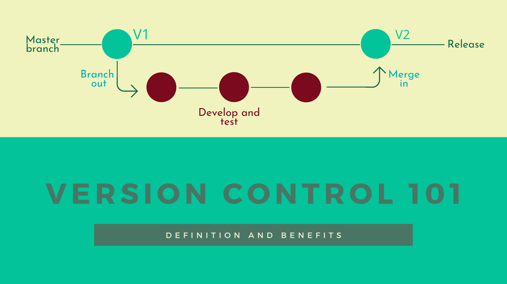
</p>

Có nhiều hệ thống VCS mà bạn có thể chọn sử dụng như: Concurrent Versions System, Subversion, Git, Mercurial,...Nổi bật trong đó là **Git**

## Tại sao lại cần nó?

Giả sử trường hợp bạn cần làm dự án theo team 3, 4 thành viên. Như vậy mỗi thành viên sẽ code một số module nhỏ, cuối cùng sẽ phải đến ngày gộp code. Có 2 trường hợp xảy ra, hoặc là team bạn phải ra quán coffee gộp code (như mình từng làm khi mới học code) hoặc team bạn sử dụng version control. Với công cụ này, mỗi thành viên team bạn có thể tạo ra 1 phiên bản riêng cho mình (branch) và làm việc độc lập trên đó, khi cần gộp code, bạn chỉ việc gộp 2 branch lại với nhau, mọi thứ đều được version control đánh dấu thời gian rõ ràng, công việc sẽ trở nên dễ dàng hơn rất nhiều.

## Phân loại VCS

**VCS Cục Bộ**

Khi bạn chưa biết đến VCS thì chắc là bạn đã từng làm việc sau: _Giả sử bạn có một thư mục chứa một số file (code, media ...), trước khi bạn sửa đổi các file đó có thể bạn sẽ copy lại thư mục và lưu lại với một cái tên đánh dấu để nhỡ cần phục hồi lại các file gốc thì có thể copy trở lại. Việc làm của bạn chính là bạn vừa vận hành một hệ thống quản lý phiên bản_. Cách làm này đơn giản tuy nhiên gây ra nhiều lỗi như bạn có thể quyên mất thư mục ban đầu lưu trữ nhất là khó mà nhớ thời điểm lưu lại khi copy nhiều lần thư mục.

Chỉ cần từ 10 thư mục trở lên thôi là bảo đảm công việc sẽ bắt đầu có sự nhầm lẫn.

Để giải quyết vấn đề này, các lập trình viên từ lâu đã phát triển nên một VCS cục bộ với một cơ sở dữ liệu đơn giản chỉ nhằm mục đích duy nhất: Lưu giữ tất cả từng phiên bản và ghi nhận các thay đổi của từng phiên bản sau đó. Hệ thống đó bạn có thể gọi là VCS cục bộ, mô hình hóa hoạt động như hình.

<p align="center">
	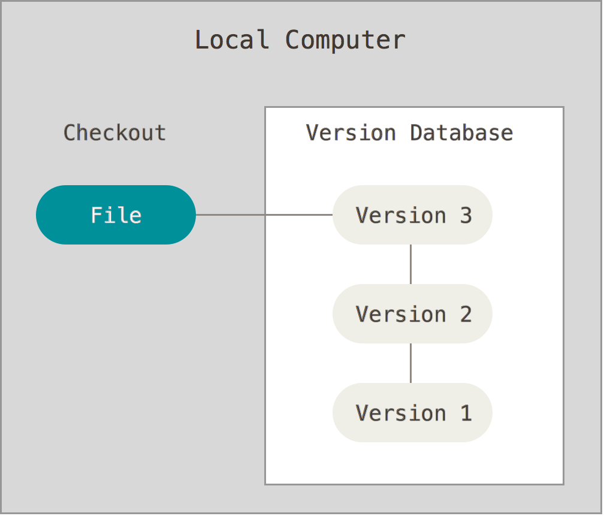
</p>

Công cụ nổi tiếng có thể kể đến là **RCS** (Revision Control System), vẫn còn được sử dụng ở nhiều hiện nay. Thậm chí trong các máy tính MAC OS X nó vẫn tích hợp vào các công cụ lập trình (IDE) lệnh rcs để người dùng có thể tự quản lý các phiên bản khác nhau của dự án tại từng thời điểm.

**VCS Trung Tâm**

Nhưng nếu áp dụng như cách trên vừa nói, chuyện lại nảy sinh tiếp theo là: Mình muốn chia sẻ các phiên bản dự án của mình với các đồng nghiệp khác trong cùng hệ thống (trong một công ty) thì làm thế nào? Vẫn phải tìm và copy rồi gửi cho đồng nghiệp? Việc tự quản lý các phiên bản để tránh nhầm lẫn đã giải quyết xong rồi, còn chia sẻ thế nào cho nhanh chóng lại nảy sinh.

Giải pháp VCS tập trung ra đời.

Các hệ thống này – có thể kể tên như CVS, Subversion, Perforce – đều triển khai một máy chủ chứa toàn bộ các tập tin phiên bản khác nhau của tất cả các dự án của từng người trong nội bộ công ty đang làm việc. Các đồng nghiệp này có thể truy xuất lên đây và xem của nhau đều được.

<p align="center">
	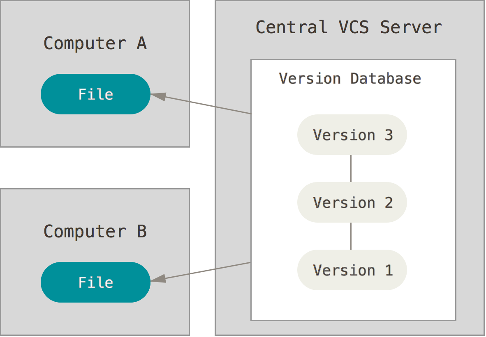
</p>

Cách này tỏ ra hiệu quả trong thời gian dài, khi mà nó giải quyết được cả 2 vấn đề là tổ chức, lưu trữ các phiên bản hiệu quả; chia sẻ và truy xuất các phiên bản của từng cá nhân khác nhau dễ dàng hơn.

Tuy nhiên CVCS vẫn có nhược điểm khi Sever bị dừng thì không thể kết nối các thành viên làm việc, hoặc mất dữ liệu (do ở đĩa hư hỏng) khì rất khó khôi phục lại file.

**VCS Phân Tán**

VCS phân tán sẽ giải quyết câu chuyện đau đầu trên. Có thể kể những cái tên tiêu biểu như Git, Mercurial, Bazaar hay Darcs. Ở giải pháp này, các máy truy cập tới không đơn giản chỉ tải về phiên bản mới nhất của dữ liệu, mà nó sẽ tải về toàn bộ kho chứa (Repository). Do đó, nếu có một máy chủ nào ngưng hoạt động đi nữa, thì cũng có thể truy xuất được dữ liệu dễ dàng từ một máy khác để khôi phục lại những gì đã mất.

<p align="center">
	
</p>

Điểm nổi trội khác nữa có thể kể đến, đó là các hệ thống kiểu này xử lý rất hiệu quả trong việc quản lý các Repository từ xa, nhằm giúp cho một người có thể cộng tác và làm việc với nhiều người khác nhau ở bất kỳ đâu.

**Git** chính là hệ thống quản lý phiên bản phân tán (DVCS), với các ưu điểm: tốc độ, đơn giản, phân tán, phù hợp với dự án lớn nhỏ.

## Git là gì?

**Git** là một hệ thống quản lý phiên bản phân tán (Distributed Version Control System – DVCS), nó là một trong những hệ thống quản lý phiên bản phân tán phổ biến nhất hiện nay. Git cung cấp cho mỗi lập trình viên kho lưu trữ (repository) riêng chứa toàn bộ lịch sử thay đổi.

## Cơ chế hoạt động?

Sự khác biệt chính giữa Git và bất kỳ VCS nào khác (bao gồm Subversion…) là cách Git nghĩ về dữ liệu của nó.

Về mặt khái niệm, hầu hết các hệ thống khác đều lưu trữ thông tin dưới dạng danh sách các thay đổi dựa trên file. Các hệ thống này (CVS, Subversion, Perforce, Bazaar, v.v.) coi thông tin chúng lưu giữ dưới dạng một tập hợp các file và những thay đổi được thực hiện đối với mỗi file theo thời gian.

<p align="center">
	
</p>

Git không nghĩ đến hoặc lưu trữ dữ liệu của mình theo cách này. Thay vào đó, Git coi thông tin được lưu trữ là một tập hợp các snapshot – ảnh chụp toàn bộ nội dung tất cả các file tại thời điểm.

Mỗi khi bạn “commit”, Git sẽ “chụp” và tạo ra một snapshot cùng một tham chiếu tới snapshot đó. Để hiệu quả, nếu các tệp không thay đổi, Git sẽ không lưu trữ lại file — chỉ là một liên kết đến tệp giống file trước đó mà nó đã lưu trữ. Git nghĩ về dữ liệu của nó giống như dưới đây:

<p align="center">
	
</p>

Đây là điểm khác biệt quan trọng giữa Git và gần như tất cả các VCS khác. Nó khiến Git phải xem xét lại hầu hết mọi khía cạnh của kiểm soát phiên bản mà hầu hết các hệ thống khác đã sao chép từ thế hệ trước. Điều này làm cho Git giống như một hệ thống tệp nhỏ với một số công cụ cực kỳ mạnh mẽ được xây dựng trên nó, thay vì chỉ đơn giản là một VCS.

## Dữ liệu lưu trữ trong Git đảm bảo tính toàn vẹn

Mọi thứ trước khi được lưu trữ vào Git đều đước kiểm tra bởi mã băm (hash, checksum), có nghĩa là không thể thay đổi nội dung của file mà Git không biết về sự thay đổi đó. Chức năng này giúp cho bạn không thể mất thông tin khi trao đổi dữ liệu hay file lỗi mà không thể nhận ra được. Git sử dũng mã hash SHA-1, mỗi chuỗi hash SHA-1 sinh ra căn cứ theo nội dung của file dài 40 ký tự (tạo ra từ các ký tự trong khoảng thập lục phân : 0-9, a-f) có dạng:

```hash
62FC2DBFB0CB299DD8548286FE1BB1D2B2041379
```

Mã hash kiểu này bạn sẽ gặp thường xuyên khi làm việc với Git vì mọi thứ lưu trong dữ liệu đều căn cứ theo mã hash này.

## Git có lợi ích gì?

Các dự án thực tế thường có nhiều lập trình viên làm việc song song. Vì vậy, một hệ thống kiểm soát phiên bản như Git là cần thiết để đảm bảo không có xung đột code giữa các lập trình viên.

Ngoài ra, các yêu cầu trong các dự án như vậy thay đổi thường xuyên. Vì vậy, một hệ thống kiểm soát phiên bản cho phép các nhà phát triển revert và quay lại phiên bản cũ hơn của code.

Cuối cùng, đôi khi một số dự án đang được chạy song song liên quan đến cùng một cơ sở code. Trong trường hợp như vậy, khái niệm phân nhánh trong Git là rất quan trọng.

- Dễ sử dụng, thao tác nhanh, gọn, lẹ và rất an toàn.
- Sễ dàng kết hợp các phân nhánh (branch), có thể giúp quy trình làm việc code theo nhóm đơn giản hơn rất nhiều.
- Chỉ cần clone mã nguồn từ kho chứa hoặc clone một phiên bản thay đổi nào đó từ kho chứa, hoặc một nhánh nào đó từ kho chứa là bạn có thể làm việc ở mọi lúc mọi nơi.
- Deployment sản phẩm của bạn một cách không thể nào dễ dàng hơn.

# Cài đặt và cấu hình Git

## Tải Git

Có nhiều cách để đến với trang chủ của **Git**, bạn có thể tìm kiếm trên Google và lựa chọn trong kết quả tìm kiếm hoặc đến trực tiếp trang chủ bằng cách gõ vào thanh điều hướng trình duyệt đường dẫn

> https://git-scm.com/

Bấm vào nút `Download 2.32.0 for Windows` để tải tập tin cài đặt về.

_Lưu ý rằng con số **2.32.0** là phiên bản **Git** hiện tại được phát hành, nó có thể bị thay đổi bởi các phiên bản mới hơn. Xem thêm ảnh minh họa bên dưới_

<p align="center">
	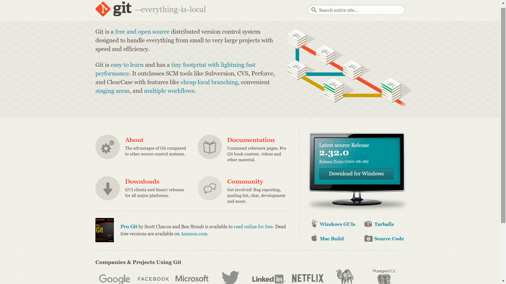
</P>

Hệ thống trang tải của Git sẽ tự động gửi tập tin cài đặt phù hợp với hệ điều hành Windows hiện tại của bạn. _Ngoài ra, bạn còn có thể tải thêm các phiên bản khác tùy ý._

<p align="center">
	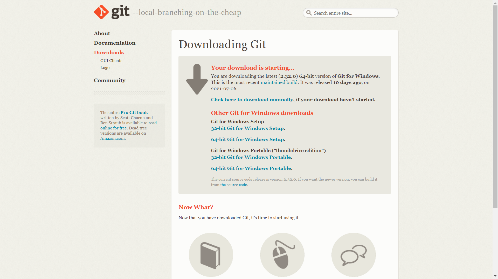
</P>

## Cài đặt Git

Sau quá trình chờ tải về, bạn sẽ có được một tệp thực thi trên máy có tên dạng `Git-2.32.02-64-bit.exe`, trong đó:

- **2.32.0** đã nói ở trên bước 1 rồi, là phiên bản của Git lúc đó.
- **64-bit** là kiến trúc mà hệ điều hành Windows của máy đang dùng để cài Git. _Xem thêm ảnh minh họa bên dưới:_

<p align="center">
	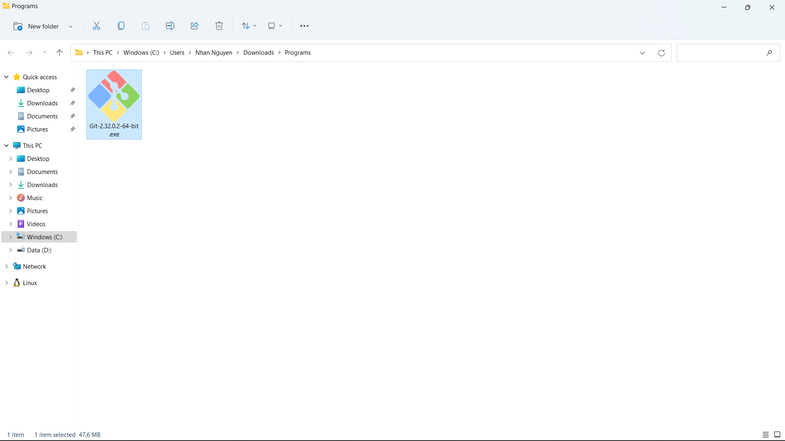
</P>

Thực thi tập tin đó bằng cách `Bấm đôi chuột` hoặc `Bấm chuột phải` lên tệp đó rồi chọn `Open`.

Tiếp tục, chúng ta sẽ gặp `Điều khoản (Giấy phép)`, nếu đọc tốt tiếng Anh thì bạn có thể dành thời gian để đọc cho rõ. Bình thường, chúng ta hay `Đồng ý` mà không đọc gì tất.

Đọc xong rồi thì nhấn nút `Next `. _Xem thêm ảnh minh họa bên dưới:_

<p align="center">
	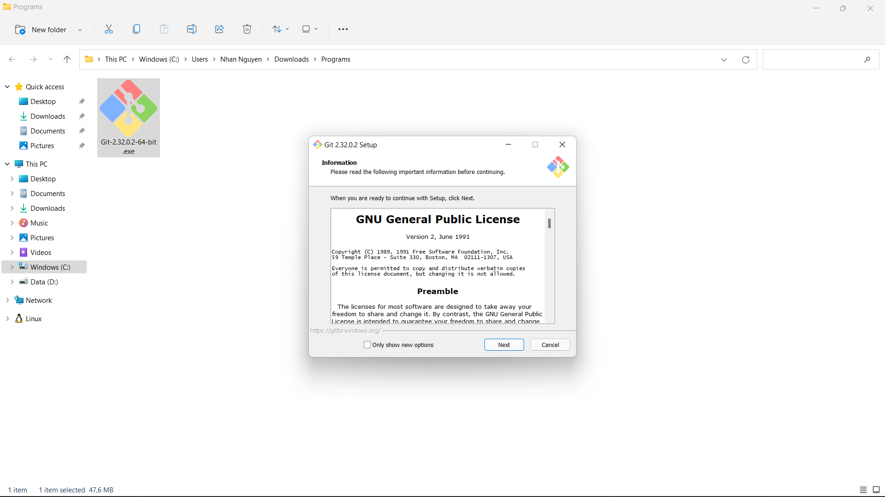
</P>

Chương trình cài đặt sẽ cho chúng ta lựa chọn **vị trí lưu trữ để cài đặt chương trình Git**. Bạn có thể nhấn nút `Browse`... để chọn lại hoặc gõ đường dẫn vào ô. Đồng thời, chương trình cài đặt cũng sẽ cho bạn biết mức độ chiếm dụng của dữ liệu sẽ cài lên máy được yêu cầu để chứa là bao nhiêu (kích cỡ MB tối thiểu). Chọn xong đường dẫn rồi thì nhấn `Next`.

Trình cài đặt lại cho bạn một danh sách các lựa chọn:

**Các lựa chọn đã được chọn sẵn (tick)**: Bao gồm các trình cơ bản của Git là dòng lệnh, giao diện đồ họa, các gói hỗ trợ, khai báo loại tập tin,... Chúng ta nên để cho nó chọn đi.

Nói thêm về các dòng chưa chọn:

- **Additional icon, bao gồm On the Desktop**: là cài biểu tượng lên màn hình làm việc để bạn mở giao diện đồ họa và cửa sổ dòng lệnh của Git nhanh hơn. Cũng nên chọn chứ! Nếu bạn lười vào Start menu.
- **Use a TrueType font in all console windows**: là dùng Phông chữ kiểu TrueType cho tất cả các cửa sổ dòng lệnh. Nếu chọn dòng này, Git có thể hỗ trợ tốt hơn tiếng Việt trên các cửa sổ lệnh, bạn dùng giao diện đồ họa thì không cần chọn cũng được.
- **Check daily for Git for Windows updates**: là kiểm tra phiên bản hằng ngày xem có Git mới không để cập nhật luôn. Nếu bạn là người thích sự ổn định, ít thay đổi thì có thể bỏ qua lựa chọn này, còn nếu bạn là người thích theo đuổi những điều mới mẽ thì chọn để xem các tính năng của Git mới sau này là gì nhé! Ngoài ra, cập nhật thường xuyên cũng là một trong những việc tăng cường bảo mật, khắc phục các lỗi của bản cũ.
  Chọn xong sau đó nhấn `Next`
- **Add a git Bash profile to Windows Terminal**: Thêm shell git Bash vào Windows Terminal. Đây là tính năng khá mới và thích hợp cho Windows 11.

_Xem thêm ảnh minh họa bên dưới:_

<p align="center">
	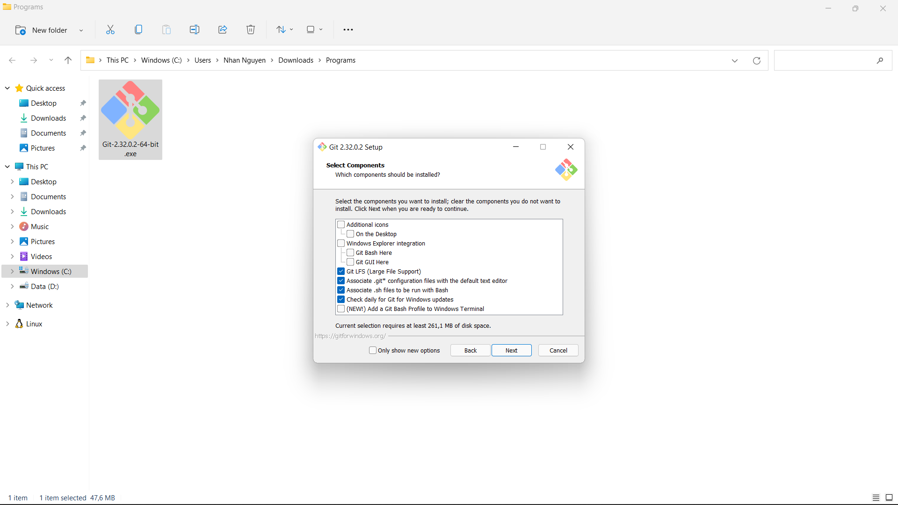
</P>

Quá trời nhiều lựa chọn, và tiếp theo là lựa chọn xem nên đạt Git vào Start menu như thế nào. Có thể chọn `Don't create a Start Menu folder` để không tạo ra cái thư mục Git trên Start Menu, nếu bạn không cần dùng tới. Bình thường, cứ không chọn, để nguyên như vậy rồi bấm `Next` thôi.

Sau khi lựa chọn Start Menu, trình cài đặt yêu cầu lựa chọn một chương trình soạn thảo để chúng ta có thể biên tập lệnh cho Git bash. Mặc đinh là dùng Vim. Xem hình ảnh minh họa bên dưới. Tuy nhiên tôi sẽ sử dụng Visual Studio Code vì máy tính Windows của mình đã có cài sẵn rồi.

<p align="center">
	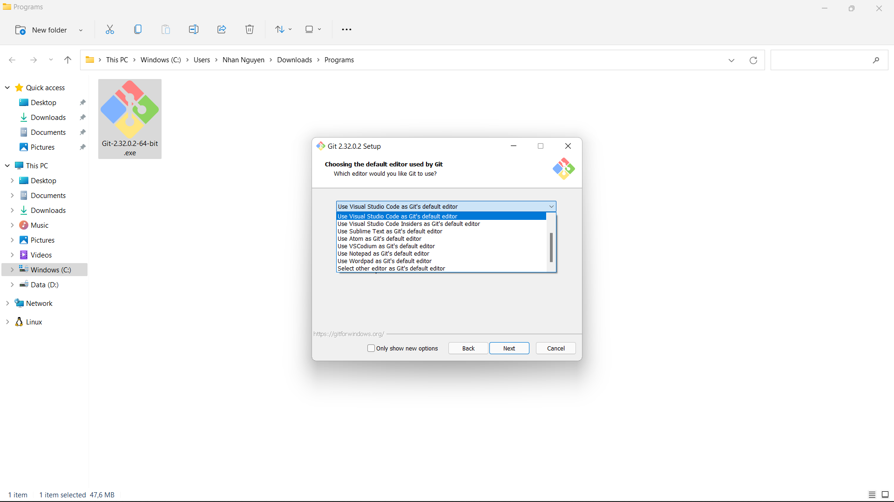
</P>

Tiếp đên, trình cài đặt sẽ hỏi chúng ta lựa chọn tên nhanh sau khi gõ lệnh `git init`, Ở phần này mình sẽ để mặc định là sau khi gõ lệnh `git init` sẽ tạo nhánh có tên là `master`

<p align="center">
	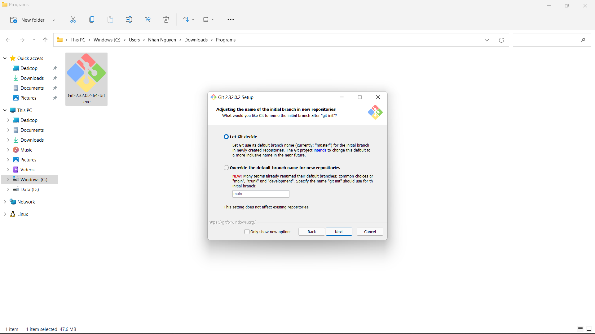
</P>

Tiếp theo, trình cài đặt Git yêu cầu chúng ta lựa chọn cài đặt về biến môi trường, nếu không cần dùng biến `PATH` để là môi trường mặc định cho Git thì bạn có thể lựa chọn `Use Git from Git Bash only`.

Mình cài Git trên Windows, cũng nên tạo một môi trường cho Git để thuận tiện hơn. Vì thế mình vẫn để nguyên lựa chọn là `Git from the command line and also from 3rd-party software`. Rồi còn chờ gì nữa mà không nhấn `Next`. Xem hình ảnh minh họa bên dưới.

<p align="center">
	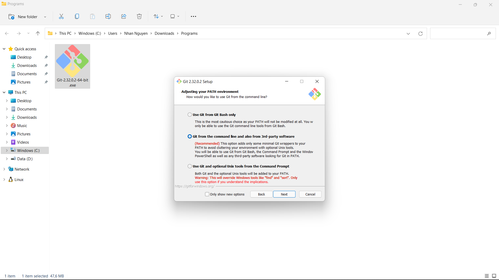
</P>

Bên dưới, là hình ảnh trình cài đặt Git yêu cầu bạn lựa chọn sử dụng phương thức bảo mật nào cho các kết nối giao thức HTTPS (giap thức web tăng cường bảo mật). Bạn có thể chọn dùng theo loại chứng chỉ nào mà bạn thích. Ở đây, tôi vẫn sẽ để mặc định là `Use the OpenSSL library` để sử dụng thư viện chứng chỉ bảo mật này (thư viện mở).

Nhấn tiếp nút `Next`.

<p align="center">
	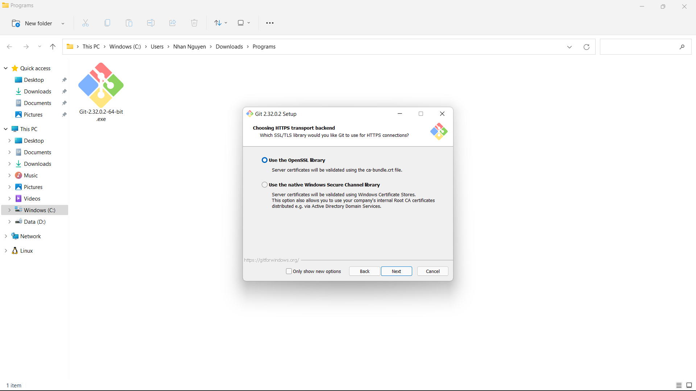
</P>

Tiếp theo, lựa chọn chế độ dấu kết thúc dòng (xuống dòng). Sở dĩ có lựa chọn này là do dấu xuống dòng trong hệ điều hành Linux, Unix, MacOS và Windows là khác nhau.

Chúng ta cứ để mặc định là `Checkout Windows-style, commit Unix-style line endings` để Git tự chuyển qua lại giữa các loại này khi tải mã nguồn lên xuống giữa máy Windows của mình và máy chủ lưu trữ Repository. Xem hình ảnh minh họa bên dưới

Rồi, bấm tiếp nút `Next`.

<p align="center">
	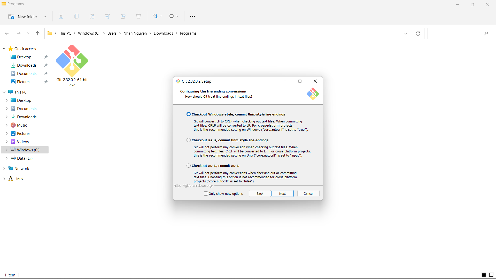
</P>

Tiếp theo trình cài đặt Git yêu cầu chúng ta lựa chọn chương trình hiển thị cửa sổ dòng lệnh để tương tác với chúng ta về sau.

Bạn nào là Fan ruột thật sự ruột của Windows thì chọn `Use Windows' default console window` để chọn cái màn hình đen chữ trắng mặc định của Windows (mách nhỏ là nó có thể đổi màu).

Tuy nhiên, để cho thuận tiện hiển thị tiếng Việt và đẹp mắt, chúng ta nên chọn như mặc định là Use `MinTTY (the default terminal of MSYS2)` để Git cài một trình giả lập cửa sổ dòng lệnh tên là `MinTTY` của `MSYS2`. Bấm nút `Next` tiếp thôi nào!

<p align="center">
	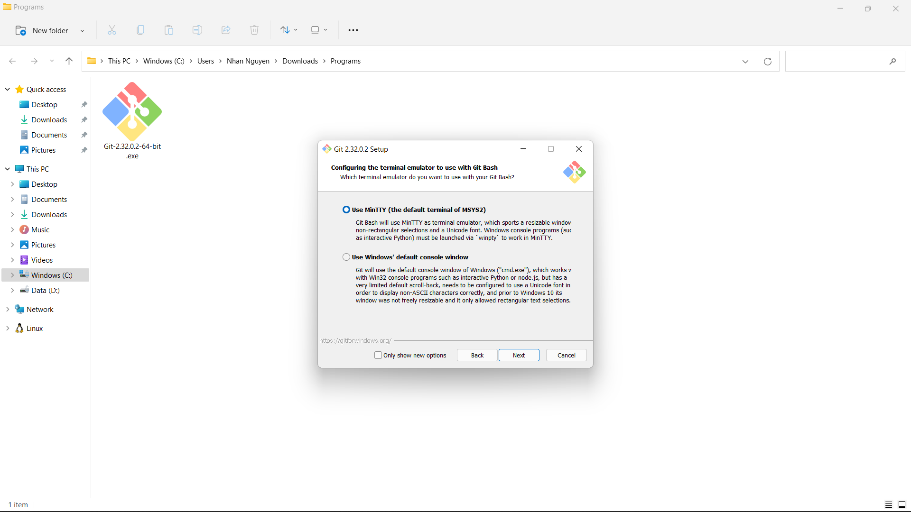
</P>

Tiếp theo, trình cài đặt Git sẽ hỏi thiết lập `git pull`, ở mình sẽ để `Default` và ấn `Next`.

<p align="center">
	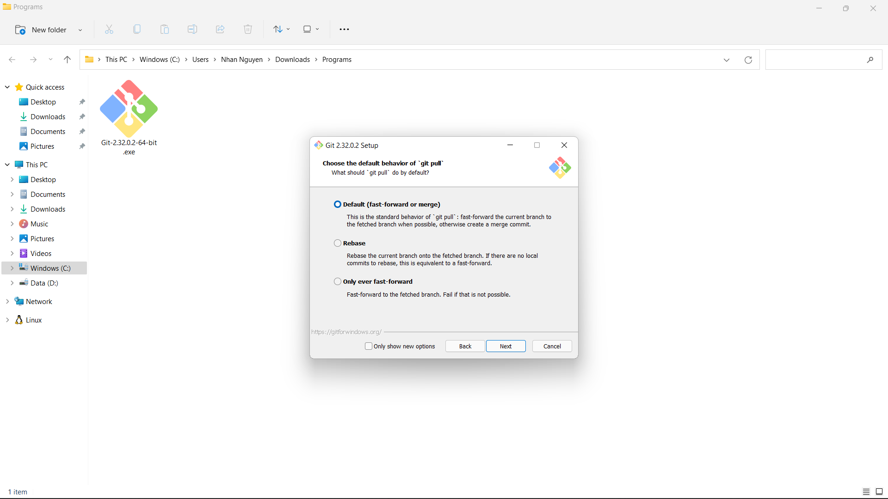
</P>

Tiếp theo git sẽ hỏi chọn khả năng trợ giúp khi sử dụng Git, nếu như bạn không muốn trợ giúp thì hãy ấn `None`. Rồi ân `Next`

<p align="center">
	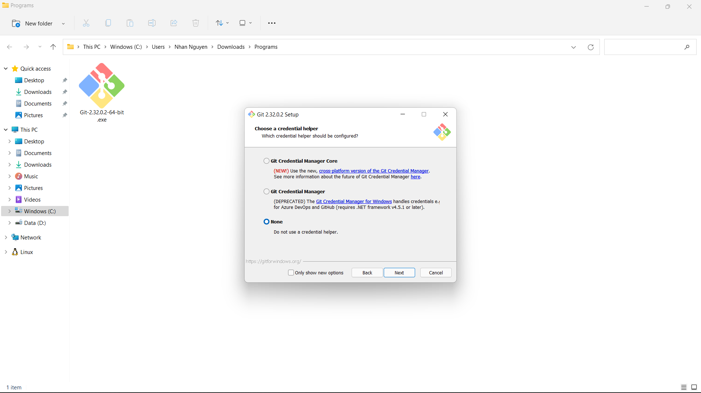
</P>

Tiếp theo là một số cài đặt về lưu trữ (cài đặt mở rộng). Cứ mặc định mà bấm `Next` thôi bạn ơi! Xem hình ảnh minh họa bên dưới.

<p align="center">
	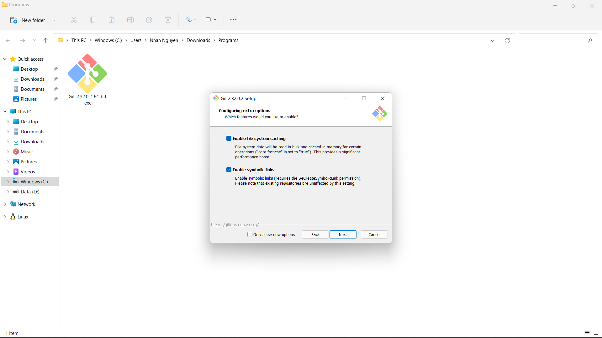
</P>

Tiếp theo là một số cài đặt về thử ngiệm. Sau đó ấn `Install` để cài đặt. Xem hình ảnh minh họa bên dưới.

<p align="center">
	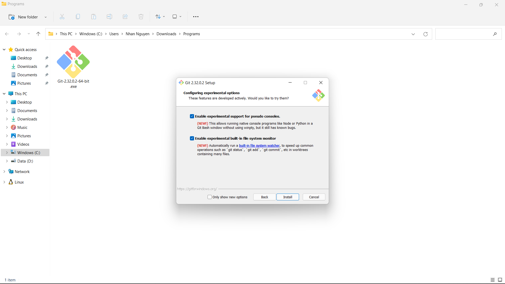
</P>

Sau khi cài đặt xong mở PowerShell hoặc Command Prompt lên gõ lệnh:

```powershell
git --version
```

Nếu kết quả trả về như hình bên dưới là bạn đã cài đặt Git thành công.

<p align="center">
	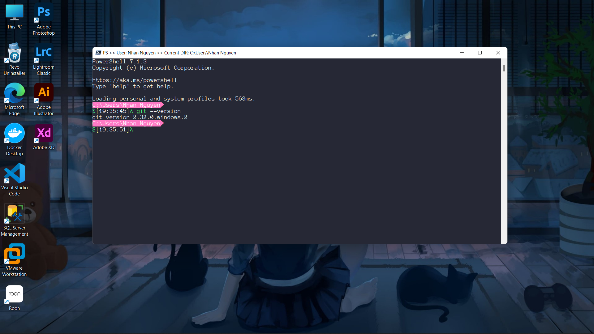
</P>

Vậy là chúng ta đã cài đặt xong Git!!

## Cài đặt Git trên MacOS và Ubuntu

**MacOS**

**Bước 1:** cài đặt Git

Mở terminal và chạy lệnh dưới đây để cài đặt Git bằng Homebrew:

```bash
brew install git
```

Lệnh trên sẽ cài đặt Git trên máy của chúng ta. Bước tiếp theo là xác minh cài đặt.

**Bước 2:** Xác minh cài đặt

Điều cần thiết là phải đảm bảo rằng quá trình cài đặt có thành công hay không.

Để xác minh xem cài đặt đã thành công hay chưa, hãy chạy lệnh dưới đây:

```bash
git --version
```

Lệnh trên sẽ hiển thị phiên bản đã được cài đặt trên hệ thống của bạn. Hãy xem xét đầu ra dưới đây:

```bash
git version 2.32.0
```

**Ubuntu**

**Bước 1:** cài đặt Git

Mở terminal và chạy lệnh dưới đây để cài đặt Git:

```bash
sudo apt install git all
```

Lệnh trên sẽ cài đặt Git trên máy của chúng ta. Bước tiếp theo là xác minh cài đặt.

**Bước 2:** Xác minh cài đặt

Điều cần thiết là phải đảm bảo rằng quá trình cài đặt có thành công hay không.

Để xác minh xem cài đặt đã thành công hay chưa, hãy chạy lệnh dưới đây:

```bash
git --version
```

Lệnh trên sẽ hiển thị phiên bản đã được cài đặt trên hệ thống của bạn. Hãy xem xét đầu ra dưới đây:

```bash
git version 2.32.0
```

## Cấu hình Git lần đầu

Bây giờ Git đã có trên hệ thống, bạn muốn tuỳ biến một số lựa chọn cho môi trường Git của bạn. Bạn chỉ phải thực hiện các bước này một lần duy nhất; chúng sẽ được ghi nhớ qua các lần cập nhật. Bạn cũng có thể thay đổi chúng bất kỳ lúc nào bằng cách chạy lại các lệnh.

Git cung cấp sẵn git config cho phép bạn xem hoặc chỉnh sửa các biến cấu hình để quản lý toàn bộ các khía cạnh của Git như giao diện hay hoạt động. Các biến này có thể được lưu ở ba vị trí khác nhau:

- `/etc/gitconfig` : Chứa giá trị cho tất cả người dùng và kho chứa trên hệ thống. Nếu bạn sử dụng `--system` khi chạy `git config`, thao tác đọc và ghi sẽ được thực hiện trên tập tin này.
- `~/.gitconfig` : Riêng biệt cho tài khoản của bạn. Bạn có thể chỉ định Git đọc và ghi trên tập tin này bằng cách sử dụng `--global`.
- Tập tin config trong thư mục git `(.git/config)` của bất kỳ kho chứa nào mà bạn đang sử dụng: Chỉ áp dụng riêng cho một kho chứa. Mỗi cấp sẽ ghi đè các giá trị của cấp trước nó, vì thế các giá trị trong `.git/config` sẽ "ghi đè" các giá trị trong `/etc/gitconfig`.
- Trên Windows, Git sử dụng tập tin `.gitconfig` trong thư mục `$HOME` (`%USERPROFILE% trên môi trường Windows`), cụ thể hơn đó là `C:\Documents` and `Settings\$USER` hoặc `C:\Users\$USER`, tuỳ thuộc vào phiên bản Windows đang sử dụng (`$USER là %USERNAME%` trên môi trường Windows). Nó cũng tìm kiếm tập tin `/etc/gitconfig`, mặc dù nó đã được cấu hình sẵn chỉ đến thư mục gốc của MSys, có thể là một thư mục bất kỳ, nơi bạn chọn khi cài đặt.

**Thiết lập danh Tính Của Bạn**

Việc đầu tiên bạn nên làm khi cấu hình Git là chỉ định tên tài khoản và địa chỉ e-mail. Điều này rất quan trọng vì mỗi Git sẽ sử dụng chúng cho mỗi lần commit, những thông tin này được gắn bất di bất dịch vào các commit:

```bash
$ git config --global user.name "FoxMinChan"
$ git config --global user.email nguyenxuannhan407@gmail.com
```

Vì chỉ phải làm việc này một lần duy nhất nên như sử dụng `--global`, vì Git sẽ sử dụng các thông tin đó cho tất cả những gì bạn làm trên hệ thống. Nếu bạn muốn sử dụng tên và địa chỉ e-mail khác cho một dự án riêng biệt nào đó, bạn có thể chạy lại lệnh trên không sử dụng `--global `trên dự án đó.

**Trình Soạn Thảo**

Bây giờ danh tính của bạn đã được cấu hình xong, bạn có thể lựa chọn trình soạn thảo mặc định sử dụng để soạn thảo các dòng lệnh. Mặc định, Git sử dụng trình soạn thảo mặc địch của hệ điều hành, thường là Vi hoặc Vim. Nếu bạn muốn sử dụng một trình soạn thảo khác, như Emacs, bạn có thể sửa như sau:

```bash
$ git config --global core.editor emacs
```

Ở phần cài đặt Git, mình đã set Visual Studio Code làm trình soạn thảo mặc định cho nên trình soạn thảo mặc đinh của mình là Visual Studio Code.

**Công Cụ So Sánh Thay Đổi**

Một lựa chọn hữu ích khác mà bạn có thể muốn thay đổi đó là chương trình so sánh sự thay đổi để giải quyết các trường hợp xung đột nội dung. Ví dụ bạn muốn sử dụng vimdiff:

```bash
$ git config --global merge.tool vimdiff
```

Git chấp nhận kdiff3, tkdiff, meld, xxdiff, emerge, vimdiff, gvimdiff, ecmerge, và opendiff là các công cụ trộn/sát nhập (merge) hợp lệ. Bạn cũng có thể sử dụng một công cụ yêu thích khác.

**Kiểm Tra Cấu Hình**

Nếu như bạn muốn kiểm tra các cấu hình cài đặt, bạn có thể sử dụng lệnh `git config --list` để liệt kê tất cả các cài đặt của Git:

```powershell
diff.astextplain.
textconv=astextplain
filter.lfs.clean=git-lfs clean -- %f
filter.lfs.smudge=git-lfs smudge -- %f
filter.lfs.process=git-lfs filter-process
filter.lfs.required=true
http.sslbackend=openssl
http.sslcainfo=C:/Program Files/Git/mingw64/ssl/certs/ca-bundle.crt
core.autocrlf=true
core.fscache=true
core.symlinks=true
pull.rebase=false
credential.helper=manager-core
credential.https://dev.azure.com.usehttppath=true
init.defaultbranch=master
core.editor="C:\Users\Nhan Nguyen\AppData\Local\Programs\Microsoft VS Code\Code.exe" --wait
user.email=nguyenxuannhan407@gmail.com
user.name=FoxMinChan
```

Bạn cũng có thể kiểm tra giá trị của một từ khoá riêng biệt nào đó bằng cách sử dụng `git config {key}`:

```powershell
git config user.name
FoxMinChan
```

# Trạng thái của Git

Mỗi tập tin trong Git được quản lý dựa trên ba trạng thái đó là **committed**, **modified**, và **staged**. Trong đó:

- **Committed** có nghĩa là dữ liệu đã được lưu trữ một cách an toàn trong cơ sở dữ liệu, tức là những gì bạn đã commit thành công.
- **Staged** là bạn đã đánh dấu sẽ commit phiên bản hiện tại của một tập tin đã chỉnh sửa trong lần commit sắp tới. Trạng thái này xảy ra khi bạn sử dụng lệnh git add <file_name> nhưng chưa commit.
- **Modified** có nghĩa là bạn đã thay đổi tập tin nhưng chưa commit vào cơ sở dữ liệu, tức là bạn chưa sử dụng lênh git add và git commit.

Như vậy với 3 trạng thái này đã tạo ra ba phần riêng biệt của một dự án có sử dụng Git:

- **Khu vực Git (Git directory)**: Là thư mục lưu trữ siêu dữ liệu (metadata) và cơ sở dữ liệu của dự án, thư mục này sẽ bị ẩn bởi hệ điều hành Windows nên bạn phải bật chức năng hiển thị file ẩn thì mới thấy được. Khu vực này sẽ tiếp nhận và lưu trữ các commit từ stage area.
- **Khu vực làm việc (Working directory)**: Nếu bạn không sử dụng Remote repository thì đây là bản sao của dự án, còn không thì đây là thư muc chính của dự án và branch master chính là bản chính, còn các branch mới tạo là branch bản sao.
- **Khu vực tổ chức (staging area)**: đây là một tập tin đơn giản nằm trong thư mục git, nó sẽ chứa thông tin về trạng thái của một file trong dự án.

<p align="center">
	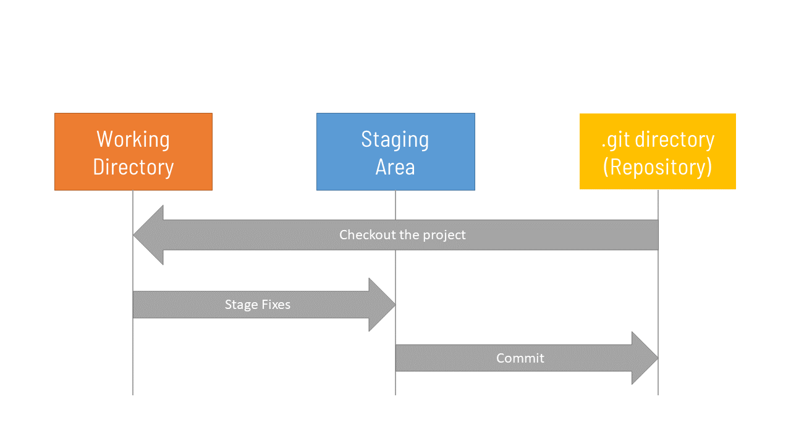
</P>

Như vậy nếu bạn thay đổi một file nhưng chưa sử dụng lệnh git add và git commit thì file đó ở trạng thái Modified, còn nếu bạn đã sử dụng lệnh git add thì sẽ ở trạng thái staged, còn đã commit thì sẽ ở trạng thái Committed.

**Commited - sửa + add + commit**

```bash
$ git checkout task1
$ git add demo.txt
$ git commit -m "Sua file demo.txt"
```

**Staged - Sửa + add**

```bash
$ git checkout task1
$ git add demo.txt
```

**Modified - Sửa + ko làm gì**

```bash
$ git checkout task1
```

# Những câu lệnh Git cơ bản

## Lệnh git init

Lệnh git init được sử dưng để tạo, khởi tạo một kho chứa **Git** mới (Git Repo) ở local. Khi đang trong thư mục dự án chạy lệnh git init nó sẽ tạo ra một thư mục con (ẩn) tên .git, thư mục này chứa tất cả thông tin mô tả cho kho chứa dự án (Repo) mới - những thông tin này gọi là metadata gồm các thư mục như `objects`, `refs`, ... Có một file tên `HEAD` cũng được tạo ra - nó trỏ đến `commit` hiện tại.

Lệnh `git init` nhanh chóng tạo ra quản lý phiên bản của dự án dạng `none bare` mà bạn không cần có ngay một server để lưu Repo từ xa, không yêu cầu bạn phải nạp file dữ liệu nào. Tất cả phải làm là vào thư mục dự án cần khởi tạo và thi hành lệnh sau để khởi tạo:

```bash
git init
```

Sau lệnh này bạn có một Repo ở local và bắt đầu thực thi được các lệnh khác của Git.

## Lệnh git init --bare

Khi bạn cần tạo ra một Repo Git mà nó chỉ có chức năng lưu trữ - không có thư mục làm việc thì thực hiện lệnh:

```bash
git init --bare
```

Loại dự án Git này thì bạn có thể truy cập, lưu trữ, nhưng không soạn thảo, sửa file, thực hiện commit trực tiếp tại dự án. Thường tạo loại dự án này để lưu trữ như là Remote Repo (_Tạo Repo git trên Server_), từ đó lấy về Local (_lệnh git clone_), và để local đẩy dữ liệu Git lên

<p align="center">
	
</P>

## Lệnh git add

Lệnh `git add` sử dụng để **đánh chỉ mục (index)** các nội dung mới, mới cập nhật trong **thư mục làm việc**, nó chuẩn bị nội dung sắp xếp cho lần `commit` tiếp theo.

Khái niệm **đánh chỉ mục** ở trên có nghĩa là lưu lại **ảnh chụp** (snapshot) thông tin thay đổi của thư mục làm việc so với lần commit trước (hoặc so với snapshot chưa commit), snapshot lưu ở khu vực gọi là **staging** (sắp xếp, chuẩn bị)

Bạn có thể thực hiện lệnh `git add` nhiều lần để tạo tạo ra một snapshot cuối cùng trước khi thực hiện commit.

Hình ảnh sau cho biết những ảnh hưởng của lệnh `git add`:

<p align="center">
	
</P>

Lệnh git add có vài cách thực hiện với những tham số khác nhau:

**Đưa vào vùng staging file, thư mục cụ thể.**

Bạn thực hiện lệnh theo cú pháp:

```bash
$ git add file1 file2 dir1 dir2 ...
```

Ví dụ:

```bash
# Đưa vào staging file hutech.txt và file cntt.txt
git add hutech.txt cntt.txt

# Đưa thư mục tphcm (và file, thư mục con) vào staging
git add tphcm
```

Lệnh git add sẽ đưa file, thư mục vào staging - nếu file/thư mục chưa từng được giám sát bởi git nó sẽ bắt đầu giám sát và tạo snapshot là toàn bộ file/thư mục mới. Nếu đã từng giám sát - thì snapshot là nội dung thay đổi so với commit trước.

**Đưa vào vùng staging toàn bộ thư mục làm việc**

Trường hợp dùng phổ biến là đưa toàn bộ thư mục làm việc vào giám sát, và tạo snapshot trong vùng staging cho chúng thì dùng cú pháp lệnh:

```bash
git add --all
# Hoặc
git add -A
# Hoặc add [thư mục hiện tại]
git add .
```

**Lưu ý:** Lệnh trên có loại trừ (không đưa vào staging) những file, thư mục liệt kê ra trong một file `.gitignore`.

**Chú ý:** Sau khi đưa vào vùng staging, vùng này có snapshot thì bạn đã có thể sẵn sàng để thực hiện lệnh git commit để lưu sự thay đổi vào CSDL của Git

## Lệnh git status

Lệnh git status hiện thị thông tin khác nhau (do thêm mới, xóa đi, sửa đổi các file) giữa các file trong các trường hợp:

`1` Khác nhau giữa các file trong vùng staging (chỉ mục) và commit tại con trỏ HEAD (Thường HEAD ở vị trí commit cuối): `thông tin này bạn có thể thực hiện lệnh commit để lưu staging vào dữ liệu Git`

`2` Khác nhau giữa các file trong thư mục làm việc và trong staging: `bạn có thể chạy git add rồi commit`

`3` Khác nhau giữa thư mục làm việc và những file chưa được giám sát bởi Git: `bạn có thể chạy git add rồi commit`

Thông thường thì có thể thi hành ngay lệnh với cú pháp đơn giản sau để có thông tin trạng thái đầy đủ, chỉ tiết

```powershell
git status
```

<p align="center">
	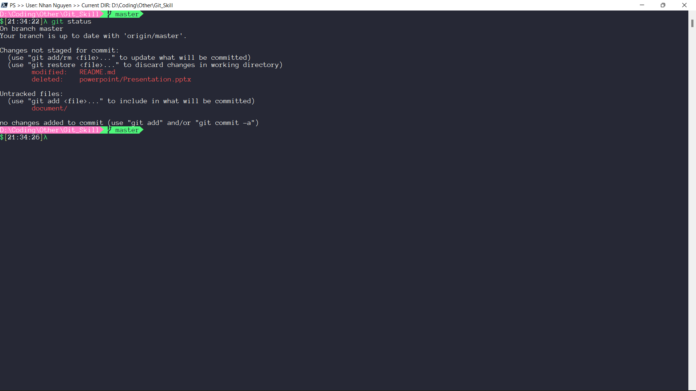
</P>

Nếu muốn hiện thị thông tin ngắn gọn hơn thì cho thêm tham số `-s`

```powershell
git status -s
```

Lúc này trước các file có sự thay đổi có thể có các ký tự tương ứng với các thông tin gồm:

- _' '_ = unmodified (không đổi)
- _M_ = modified (có sửa đổi)
- _A_ = added (file mới thêm)
- _D_ = deleted (file bị xóa)
- _R_ = renamed (đổi tên file)
- _C_ = copied (file copy từ file khác)
- _U_ = updated but unmerged (đã cập nhật, nhưng chưa merge)

<p align="center">
	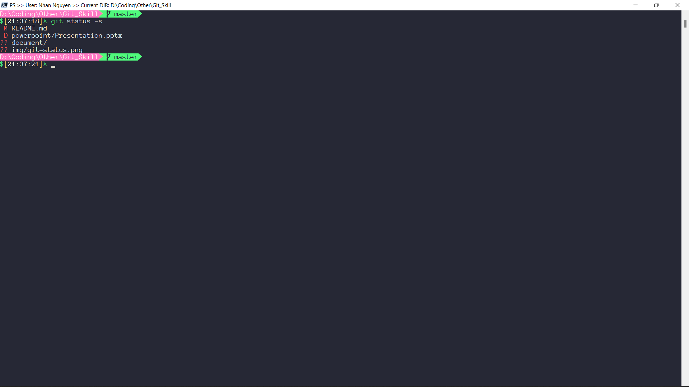
</P>

## Lệnh git commit

Lệnh `git commit` thực hiện lưu vào CSDL Git toàn bộ nội dung chứa trong `index` (vùng staging) và kèm theo nó là một đoạn text thông tin (log) mô tả sự thay đổi của của `commit` này so với `commit` trước. Sau khi `commit` con trỏ `HEAD` tự động dịch chuyển đến `commit` này (Trong nhánh hiện tại).

Khi thực hiện `commit` nếu bạn nhận ra ngay có sự nhầm lẫn nào đó bạn có thể khôi phục lại trạng thái cũ bằng lệnh `git reset` trình bày ở phần sau.

**Thực hiện commit đơn giản**

Lệnh commit cơ bản, đơn giản nhất là thực hiện với tham số -m để kèm dòng thông tin về commit

```bash
git commit -m "Ghi chú về commit"
```

Lệnh trên tạo ra một commit với nội dung lấy từ vùng staging, một điểm trong lịch sử commit được tạo ra với thông tin là dòng thông tin nhập vào, sau này bạn có thể xem lại lịch sử này bằng lệnh git log

**Thực hiện commit với tham số -a**

Khi cho tham số -a thì nó tương đương thực hiện lệnh git add để đưa các file đang được giám sát có sự thay đổi vào staging rồi tự động chạy git commit

```bash
git commit -a -m "Ghi chú về commit"
```

**Thay thế commit cuối bằng tham số --amend**

Nếu commit đã được tạo ra nhưng chưa thực hiện push lên remote (khi có làm việc với Remote Repo - nói ở các phần sau) thì bạn có thể tạo ra commit mới thay thế cho commit cuối cùng đó. Dùng trong trường hợp không muốn tạo ra nhiều commit trong lịch sử commit thì cho vào lệnh tham số --amend

```bash
git commit --amend -m "Thông tin về commit"
```

## Lệnh git reset

Khi đã thực hiện commit, commit đó chưa public (chưa đẩy lên Remote Repo bằng lệnh git push) thì bạn có thể hủy (undo) commit đó với hai trường hợp bằng lệnh `git reset` như sau:

**git reset với tham số --soft**

Trường hợp này sẽ hủy commit cuối, con trỏ HEAD sẽ chuyển về commit cha. Đồng thời những thay đổi của commit cuối được chuyển vào vùng staging nhằm để có cơ hội commit lại hoặc sửa đổi, cú pháp lệnh như sau:

```bash
git reset --soft HEAD~1
```

**git reset với tham số --hard**

Khi dùng tham số `--hard` thì kết quả giống với dùng tham số `--soft`, chỉ có một khác biết là nội dung thay đổi của commit cuối không đưa đưa vào staging mà bị hủy luôn. Trường hợp này dùng khi bạn quyết định hủy hoàn toàn commit cuối

```bash
git reset --hard HEAD~1
```

<p align="center">
	
</P>

**Một vài trường hợp dùng git reset khác**

**Hủy git add**

Nếu bạn đã dùng lệnh git add để cập nhật thay đổi vào vùng staging, bạn có thể hủy thao tác này bằng cách thực hiện lệnh:

```bash
git reset
```

**Hủy đưa một file vào staging**

Nếu muốn hủy một file nào đó trong vùng staging chứ không phải toàn bộ thì dùng lệnh

```bash
git reset -- filename
```

## Lệnh git log

Lệnh `git log` giúp bạn xem lại thông tin lịch sự commit, nhằm giám sát sự thay đổi của dự án. Lệnh `git log` có nhiều tham số để xuất ra, định dạng các thông tin hiện thị theo cách mong muốn. Bạn có thể định dạng cách các thông tin mỗi commit được in ra khi xem, cũng như có thể lọc thông tin nào đó.

Mặc đinh thi hành `git log` nó liệt kê các commit theo thứ tự từ mới nhất đến cũ nhất, mỗi commit có các thông tin gồm: mã hash của commit, dòng thông báo, người tạo commit và ngày tạo commit

```bash
git log
```

<p align="center">
	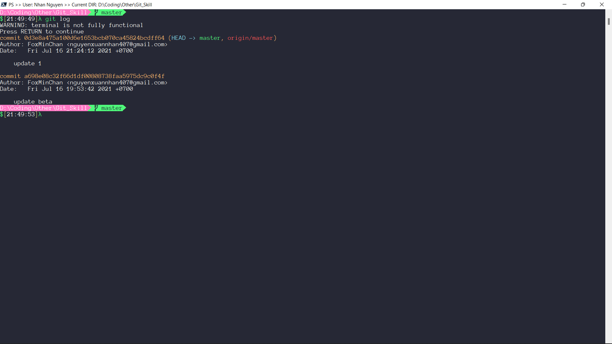
</P>

Khi số lượng log nhiều, nó hiện thị trước một trang log, sau đó có dấu nhắc chờ lệnh để bạn điều hướng, tìm kiếm ... Để có trợ giúp về các lệnh này hãy nhấn h tại dấu nhắc lệnh

Một số phím chức năng bạn có thể nhập đề điều hướng và tìm kiếm trong log như:

- `return` - dòng tiếp theo
- `w` - trang tiếp
- `spacebar` - trang trước
- `q` - thoát
- `?pattern` - tìm kiếm, với pattern là mẫu tìm kiếm (keyword)
- `/pattern` - giống ?pattern
- `n` - đến vị trí tìm kiếm phía dưới
- `N` - đến kết quả tìm kiếm phía trước

**Một số thiết lập hay dùng với git log**

Nếu chỉ muốn hiện thị một số commit log, ví dụ hiện thị log của 2 commit cuối thì cho thêm `-2` vào lệnh

```bash
git log -2
```

Nếu muốn hiện thị chi tiết các thay đổi của từng commit thì thêm vào tham số `-p`

```bash
git log -p -2
```

Nếu hiện thị thống kế gọn hơn về sự thay đổi thì dùng tham số `--stat`, hoặc dạng ngắn gọn hơn là `--shortstat`

```bash
git log --stat -5
```

Định dạng thông tin chung về commit (mã hash, dòng thông tin) trên một dòng thì dùng tham số `--oneline`

```bash
git log --oneline
git log --stat -10 --oneline
```

**Lọc kết quả với git log**

Lọc theo ngày bạn có thể dùng tham số `--after="year-month-day"` hoặc `--before="year-month-day"` hoặc dùng cả hai để chỉ ra khoảng ngày. Ví dụ: hiện thị các log từ ngày 16/6/2019 đến ngày 18/6/2021

```bash
git log --after="2021-6-16" --before="2021-6-18"
```

Lọc theo người commit dùng tham số `--author="tác giả"`, có thể kết hợp nhiều người bằng ký hiệu `\|`

```bash
git log --oneline --author="FoxMinChan"
```

Lọc theo thông tin ghi chú về commit sử dụng thiết lập `--grep="keyword ..."`

```bash
git log --oneline --grep="init"
```

Lọc các commit liên quan đến file cụ thể, sử dụng thiết lập `--` rồi liệt kê các file

```bash
git log --oneline -- src/index.php
```

Lọc theo nội dung cập nhật sử dụng tham số `-S"nội dung tìm"`

```bash
git log --oneline --shortstat -S"sendmail"
```

**Lọc các commit bình thường** (tham số `--no-merges`) và các commit do gộp nhánh (tham số `--merges`)

```bassh
git log --merges
```

**Tự định dạng hiện thị**

Bạn có thể tùy chọn hiện thị dòng thông tin với tham số `--pretty="format"`, trong đó chuỗi format là định dạng thông tin sẽ hiện thị ra cho từng commit, một số dữ liệu theo định dạng đó là:

- `%H` mã hash đầy đủ của commit
- `%h` mã hash ngắn gọn (7 ký tự đầu của hash đầy đủ)
- `%an` tên người commit (định dạng theo `--date`, ví dụ `--date="shortdate"`)
- `%s` dòng thông tin commit

```bash
git log --pretty=format:"%h - %ad  %s" --date="short"
```

**Hiện thị log commit dạng đồ thị**

Bạn có thể xem lịch sự commit một cách trực quan của một nhánh, nhất là nhánh này trong lịch sử của nó có nhiều lần gộp nhánh

```bash
git log --graph --pretty="%h %ad %s" --date="short"
```

## Lệnh git diff

Lệnh `git diff` hiện thị thông tin thay đổi giữa thư mục làm việc và vùng index (staging) hoặc với commit cũ, thông tin thay đổi giữa index(staging) và commit, thông tin thay đổi giữa hai nhánh ...

Mặc định thi hành lệnh như sau:

```bash
git diff
```

Nó hiện thị thông tin tùy ngữ cảnh như sau:

- Thông tin khác nhau giữa thư mục làm việc và commit cuối khi mà vùng index (staging) không có dữ liệu gì
- Thông tin thay đổi giữa index và commit cuối nếu vùng index có dữ liệu

**Kiểm tra sự thay đổi thư mục làm việc**

Khi có sự thay đổi của thư mục làm việc mà chưa chỉ mục, thì có thể xem sự thay đổi của nó với commit cuối

```bash
git diff
```

**Kiểm tra sự thay đổi của index (staging) với commit cuối**

```bash
git diff --staged
```

**Kiểm tra thay đổi giữa hai commit**

```bash
git diff hash-commit1 hash-commit2
```

**Kiểm tra sự thay đổi của hai nhánh**

```bash
git diff branch1 branch2
```

## Lệnh git clone

Lệnh `git clone` để sao chep, copy một Git Repo (kho chứa dự án Git) về máy đang local. Một số trường hợp sử dụng git clone như:

- Copy một Repo từ máy Remote về Local
- Copy một Repo từ thư mục này sang một thư mục khác
- Copy một Repo từ một Url (https) ví dụ GitHub

Lưu ý, khi copy Repo bình thường thì nó tự động tạo ra kết nối đến remote Repo, để có thể Push, kết nối này có tên mặc định `origin`, sau khi copy thì có thể kiểm tra bằng:

```bash
git remote -v
```

**Copy Repo từ thư mục này sang thư mục khác**

Trên máy của bạn có một Git Repo ở đường dẫn path-git, bạn có thể copy sang vị trí khác bằng lệnh:

```bash
git clone path-git
```

**Có thể chỉ rõ thư mục cần copy về thay vì tại thư mục hiện tại**

```bash
git clone path-git path-des
```

**Copy Repo từ server về bằng giao thức ssh**

Vị dụ Server có kết nối ssh: user@host, trên đó lưu một Repo ở đường dẫn `/path/to/repo`, thì có thể copy về bằng lệnh

```bash
git clone user@host:/path/to/repo.git
```

**Copy Repo bằng giao thức https**

Nhiều dịch vụ Git cung cấp kết nối bằng giao thức (https) ví dụ GitHub, GitLab thì copy về bằng lệnh:

```bash
git clone url-repo
```

Với url-repo là địa chỉ URL ví dụ: https://github.com/FoxMinChan/Powershell_Themes.git

Mặc định nó sẽ sao chép về nhánh hoạt động, để xem tất cả các nhánh có trên Remote dùng lệnh

```bash
git branch --remote
```

Để có thể lấy các nhánh khác nữa bạn cần chạy lệnh `git fetch` và `git checkout` từng nhánh muốn lấy

## Lệnh git checkout

Lệnh `git checkout` được dùng để chuyển nhánh hoặc để phục hồi file trong thư mục làm việc từ một commit trước đây ...

Từ phiên bản git 2.23 còn có thể 2 lệnh với chức năng tương ứng là: `git switch` và `git restore`

**Chuyển nhánh**

Giả sử đang ở nhánh nào đó, muốn chuyển sang nhánh master thì thực hiện lệnh:

```bash
git checkout master
```

Lúc này nhánh master hoạt động, và thư mục làm việc là các file tương ứng với nhánh này

**Phục hồi file từ phiên bản cũ**

Giả sử có file index.html, muốn phục hồi nó về phiên bản ở commit có mã hash là HASH, thì thực hiện:

```bash
git checkout HASH index.html
```

Nếu bạn muốn phục hồi nội dung từ index (staging nếu có, nếu không từ commit cuối) thì đơn giản là

```bash
git checkout index.html
```

Phục hồi nhiều file, ví dụ \*.html từ index (staging nếu có, nếu không từ commit cuối)

```bash
git checkout -- *.html
```

Có thể thực hiện với tất cả các file bằng

```bash
git checkout -- .
```

Khi bạn trở về hẳn một commit có mã HASH nào đó bằng lệnh:

```bash
git checkout HASH
```

Thì lúc này con trỏ `HEAD` sẽ chuyển đến commit này, và Git ở chế độ head detached, bạn làm việc trên một nhánh tạm thời

Nếu có thực hiện các commit trên nhánh này và cần lưu lại thì cuối cùng tạo nhánh mới bằng lệnh

```bash
git switch -c ten-nhanh-moi
```

## Lệnh git switch

Lệnh này dùng để chuyển nhánh và có thể tạo nhánh mới, ví dụ chuyển về nhánh master

```bash
git switch master
```

Tạo nhánh mới, kích hoạt nhánh bắt đầu từ một commit có mã HASH

```bash
git switch -c ten-nhanh HASH
```

Hoặc tạo nhanh từ commit cuối

```bash
git switch -c ten-nhanh
```

Chuyển về làm việc tại nhánh tạm thời bắt đầu từ commit có mã HASH

```bash
git switch --detach HASH
```

## Lệnh git restore

Lệnh `git restore` để phục hồi các file của thư mục làm việc.

Để phục hồi tất cả các file dùng lệnh:

```bash
git restore .
```

Cách sử dụng giống như `git checkout` cho trường hợp phục hồi

# Gitignore

## Gitignore là gì?

**Gitignore** là file có tên là `.gitignore` do Git quy định. Nhiệm vụ của nó là liệt kê những file mà mình **không mong muốn cho vào git** hoặc hiểu nôm na là Git sẽ bỏ qua những file đó đi. **Gitignore** hiện nay rất quan trọng trong team work, các bạn nên áp dụng ngay vào quy trình làm việc của team.

## Cách thức hoạt động của Gitignore là gì?

Có thể hiểu đơn giản là git sẽ bỏ qua file hoặc một tập các file trong project của chúng ta khi commit và push lên repository. Ví dụ:

- Các file mà IDE tự sinh ra trong quá trình build project -> Tránh tốn kém tài nguyên server lưu trữ project.
- Các file cấu hình đường dẫn của máy cá nhân -> Gây ra việc không build được project khi checkout về ở các máy thành viên khác.
- Các file cần phải giữ kín nếu như repository của bạn đang để public.
- …

Git quản lý các file mà chúng ta muốn “ignore” bằng file .gitignore được đặt ở trong thư mục root project.

Khi add 1 file mới vào git, git sẽ kiểm tra danh sách những file sẽ bỏ qua trong file `.gitignore` và không add chúng vào git. Đó mới chỉ là **điều kiện cần, điều kiện đủ** là files không có trong **git cache** nữa thì git nó mới bỏ qua, chứ files mà nằm trong **git cache** thì `.gitignore` sẽ vô tác dụng.

## Các pattern format hay dùng

- Sử dụng # để comment và có thể để cách dòng cho dễ đọc.
- Đơn giản nhất là tên file cần ignore: example.exe
- Hay cả thư mục: example_folder/
- Khi ignore thư mục **nên có dấu** / ở sau tên thư mục để nhận biết đó là thư mục, nếu không nó có thể là coi là thư mục hoặc file hay symbolic link.
- Dấu ! phía trước có ý nghĩa phủ định: !abc/example.exe
- Sử dụng 1 _ để tìm các file có cùng định dạng. Ví dụ như bạn muốn ignore tất cả các file .xml trong project: _.xml
- Trường hợp khác của 1 _ nếu bạn chỉ rõ đường dẫn ví dụ: config/_.xml thì nó chỉ có hiệu lực cho các file config/abc.xml mà không có hiệu lực cho các file config/sub/abc.xml.
- Sử dụng ** để có hiệu lực cho các thư mục không cần định rõ tên. Ví dụ: **/foo nó sẽ có hiệu lực cho tất cả file hoặc thư mục có tên là foo ở mọi nơi trong project.
- Hay sử dụng kiểu folder/\*\* để có hiệu lực cho tất cả các file bên trong thư mục.

## Tools

Hầu hết các IDE đều hỗ trợ, nếu chưa có bạn có thể cài đặt thêm plugin hay config ở đâu đó. Mình có thể chọn loại dự án mình đang làm và nó sẽ sinh tự động file .gitignore tương ứng.

Hoặc đơn giản bạn vào gitignore.io sau đó chọn loại project mình đang làm.

Sau đó nó sẽ tạo ra 1 file `.gitignore` ngon lành cho bạn. Ví dụ như 1 project Node.js nó sẽ kiểu như thế này:

```.gitignore
### Node template
# Logs
logs
*.log
npm-debug.log*

# Runtime data
pids
*.pid
*.seed

# Directory for instrumented libs generated by jscoverage/JSCover
lib-cov

# Coverage directory used by tools like istanbul
coverage

# nyc test coverage
.nyc_output

# Grunt intermediate storage (http://gruntjs.com/creating-plugins#storing-task-files)
.grunt

# node-waf configuration
.lock-wscript

# Compiled binary addons (http://nodejs.org/api/addons.html)
build/Release

# Dependency directories
node_modules
jspm_packages

# Optional npm cache directory
.npm

# Optional REPL history
.node_repl_history
```

## Phạm vi phủ sóng

File `.gitignore` sẽ ảnh hưởng đến các file và thư mục anh em với nó hoặc là con cháu, chắt của nó. Thường thì project chỉ cần 1 file `.gitignore` ở ngoài cùng là đủ nhưng nếu project quá lớn ta có thể tách file `.gitignore` vào từng folder nhỏ để dễ quản lý.

## Khi nào lên dùng Gitignore?

Bất cứ project nào cũng nên dùng nó, bạn nên tạo ngay file `.gitignore` trong thư mục gốc **ngay khi khởi tạo project** của bạn và liệt kê luôn những file mà bạn muốn git bỏ qua. Tại sao phải liệt kê trước làm gì thế? Đọc phần dưới sẽ rõ ?

## Chú ý – Git cache

Giả dụ thế này! Bạn vừa join vào project và thấy project liên tục bị conflict vì mấy file rác. Nhưng may quá bạn đọc được bài viết này và bạn rất thông minh nên đã tạo luôn file `.gitignore` cho project và thêm luôn file rác đó vào `.gitignore` rồi bạn xóa file rác đi và commit lên.

Rồi sao! 1 ông khác lại pull code mới về lại tạo ra file rác đó và nó vẫn dính vào git bình thường. W**tf? “Em cho nó vào .gitignore rồi cơ mà?**.

Vì sao à? Vì file đó đã được thằng git cache thu nạp thành của nó rồi nên thằng git nó vẫn có quyền quản lý file đó. Vậy cách giải quyết đơn giản nó phải giải thoát file đó ra khỏi **git cache** là xong, bằng 1 **dòng lệnh**:

```bash
git rm -r --cached /path/to/file_or_folder
```

Từ bây giờ file đó không còn là của **git cache** nữa nên nó không thuộc quyền quản lý của git nữa và bây giờ .gitignore mới có tác dụng. Theo lý thyết là vậy nhưng nếu bạn cần reset lại hết project để `.gitignore` hoạt động đúng thì mình thường xóa bỏ hết file của **git cache** luôn ?

```bash
git rm -r --cached .
```

Sau đó mình sẽ add tất cả các file lại vào project như lúc mới tạo project.

```bash
git add
```

Và bây giờ bạn lại commit và push như bình thường.

# Thực hành các lệnh Git cơ bản làm việc với Repository
